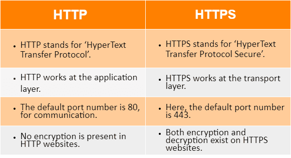
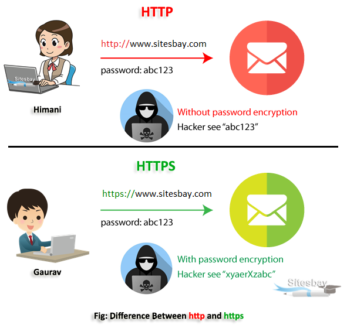

# Review networking security and protocols. (HTTP, HTTPS, SSL, SSH)

#### What is difference between HTTP and HTTPS?
HTTPS is HTTP with encryption and verification. The only difference between the two protocols is that HTTPS uses TLS (SSL) to encrypt normal HTTP requests and responses, and to digitally sign those requests and responses. As a result, HTTPS is far more secure than HTTP.

#### What is SSL and why it is used?
SSL stands for Secure Sockets Layer and, in short, it's the standard technology for keeping an internet connection secure and safeguarding any sensitive data that is being sent between two systems, preventing criminals from reading and modifying any information transferred, including potential personal details.

### An overview of the SSL or TLS handshake
The SSL or TLS handshake enables the SSL or TLS client and server to establish the secret keys with which they communicate.

This section provides a summary of the steps that enable the SSL or TLS client and server to communicate with each other.

- Agree on the version of the protocol to use.
- Select cryptographic algorithms.
- Authenticate each other by exchanging and validating digital certificates.
- Use asymmetric encryption techniques to generate a shared secret key, which avoids the key distribution problem. SSL or TLS then uses - the shared key for the symmetric encryption of messages, which is faster than asymmetric encryption.

In overview, the steps involved in the SSL handshake are as follows:

1. The SSL or TLS client sends a “client hello” message that lists cryptographic information such as the SSL or TLS version and, in the client's order of preference, the CipherSuites supported by the client. The message also contains a random byte string that is used in subsequent computations. The protocol allows for the “client hello” to include the data compression methods supported by the client.

2. The SSL or TLS server responds with a “server hello” message that contains the CipherSuite chosen by the server from the list provided by the client, the session ID, and another random byte string. The server also sends its digital certificate. If the server requires a digital certificate for client authentication, the server sends a “client certificate request” that includes a list of the types of certificates supported and the Distinguished Names of acceptable Certification Authorities (CAs).

3. The SSL or TLS client verifies the server's digital certificate. For more information, see How SSL and TLS provide identification, authentication, confidentiality, and integrity.

4. The SSL or TLS client sends the random byte string that enables both the client and the server to compute the secret key to be used for encrypting subsequent message data. The random byte string itself is encrypted with the server's public key.

5. If the SSL or TLS server sent a “client certificate request”, the client sends a random byte string encrypted with the client's private key, together with the client's digital certificate, or a “no digital certificate alert”. This alert is only a warning, but with some implementations the handshake fails if client authentication is mandatory.

6. The SSL or TLS server verifies the client's certificate. For more information, see How SSL and TLS provide identification, authentication, confidentiality, and integrity.

7. The SSL or TLS client sends the server a “finished” message, which is encrypted with the secret key, indicating that the client part of the handshake is complete.

8. The SSL or TLS server sends the client a “finished” message, which is encrypted with the secret key, indicating that the server part of the handshake is complete.

9. For the duration of the SSL or TLS session, the server and client can now exchange messages that are symmetrically encrypted with the shared secret key.

#### What is the difference between SSH and HTTP?
Both SSH and HTTP are protocols to communicate between client and server.Following are the basic difference between SSH and HTTP.

SSH means “Secure Shell”. It has a built-in username/password authentication system to establish a connection. It uses Port 22 to perform the negotiation or authentication process for connection. Authentication of the remote system is done by the use of public-key cryptography and if necessary, it allows the remote computer to authenticate users.

HTTP means HyperText Transfer Protocol. HTTP is the underlying protocol used by the World Wide Web and this protocol defines how messages are formatted and transmitted, and what actions Web servers and browsers should take in response to various commands.

#### For more information refer the below links

[Why Is HTTP not secure ?](https://www.cloudflare.com/learning/ssl/why-is-http-not-secure/)

[ SSL Handshake ](https://medium.com/@kasunpdh/ssl-handshake-explained-4dabb87cdce)