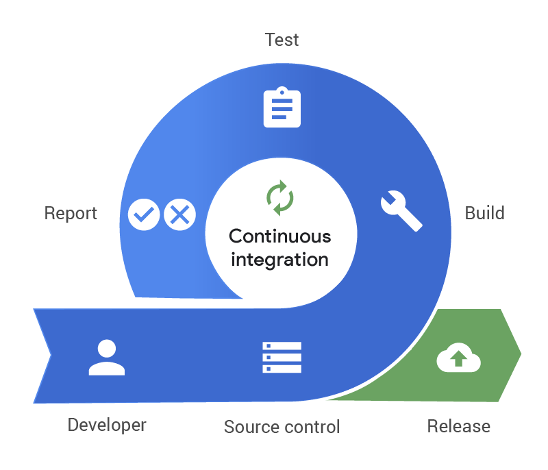

# Explore Source Code Management and Build Tool Integration Techniques for Continuous Integration (CI)
Continuous integration refers to the build and unit testing stages of the software release process. Every revision that is committed triggers an automated build and test. With continuous delivery, code changes are automatically built, tested, and prepared for a release to production.

Continuous integration is a DevOps software development practice where developers regularly merge their code changes into a central repository, after which automated builds and tests are run. Continuous integration most often refers to the build or integration stage of the software release process and entails both an automation component (e.g. a CI or build service) and a cultural component (e.g. learning to integrate frequently). The key goals of continuous integration are to find and address bugs quicker, improve software quality, and reduce the time it takes to validate and release new software updates.

## Why is Continuous Integration Needed?
In the past, developers on a team might work in isolation for an extended period of time and only merge their changes to the master branch once their work was completed. This made merging code changes difficult and time-consuming, and also resulted in bugs accumulating for a long time without correction. These factors made it harder to deliver updates to customers quickly.

## How does Continuous Integration Work?
With continuous integration, developers frequently commit to a shared repository using a version control system such as Git. Prior to each commit, developers may choose to run local unit tests on their code as an extra verification layer before integrating. A continuous integration service automatically builds and runs unit tests on the new code changes to immediately surface any errors.

Here are our top seven picks for the best continuous integration tools:
- Jenkins
- TeamCity
- Bamboo
- Buddy
- GitLab CI
- CircleCI
- TravisCI

### For more information : 

Refer to the following link for getting better understanding of [Continous Integration steps and process](https://www.atlassian.com/continuous-delivery/continuous-integration/how-to-get-to-continuous-integration)
