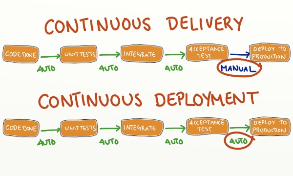

# Learn How To Advance Continuous Integration For Continuous Testing (Continuous Delivery)

Continuous deployment goes one step further than continuous delivery. With this practice, every change that passes all stages of your production pipeline is released to your customers. There's no human intervention, and only a failed test will prevent a new change to be deployed to production.

Continuous deployment is a strategy for software releases wherein any code commit that passes the automated testing phase is automatically released into the production environment, making changes that are visible to the software's users.

Continuous deployment eliminates the human safeguards against unproven code in live software. It should only be implemented when the development and IT teams rigorously adhere to production-ready development practices and thorough testing, and when they apply sophisticated, real-time monitoring in production to discover any issues with new releases.

## Continuous deployment vs. continuous delivery
Continuous integration, delivery and deployment are collectively referred to as continuous software development, and they are associated with the Agile and DevOps methodologies. Continuous delivery and deployment originate from continuous integration, a method to develop, build and test new code rapidly with automation so that only code that is known to be good becomes part of a software product.

Continuous deployment is not the same thing as continuous delivery, although the two terms are often confused and, indeed, share the acronym of CD.

## Here are top 10 continuous integration tools 
- AWS CodeDeploy
- Octopus Deploy
- Jenkins
- TeamCity
- DeployBot
- GitLab
- Bamboo
- CircleCI
- Codeship
- Google Cloud Deployment Manager

### For more information :
https://www.atlassian.com/continuous-delivery/principles/pipeline
