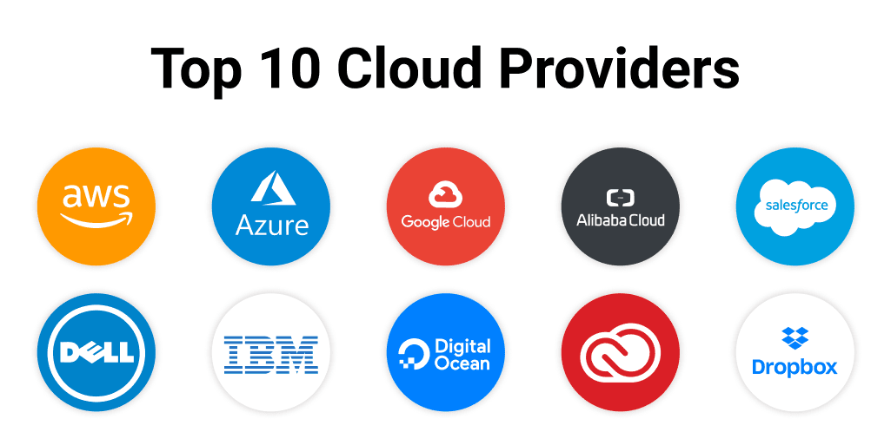

# Observe cloud service providers. (AWS, Azure, Google Cloud, Heroku)

A cloud service provider is an information technology (IT) company that provides its customers with computing resources over the internet and delivers them on-demand. CSPs are well-suited for organizations and individuals who don’t want the responsibility of installing software, hardware or network resources -- and maintaining them until the end of their life cycles.

Cloud service providers are often categorized by the type of resource they provide:

**Software as a service (SaaS)** – This type of CSP provides customers with turnkey software apps that are accessed through a web browser or application program interface (API).

**Infrastructure as a service (IaaS)** – This type of CSP provides customers with access to APIs and other resources that facilitate the creation of a virtual data center capable of supporting workloads across multi-cloud environments.

**Platform as a service (PaaS)** – This type of CSP extends the capabilities of IaaS and SaaS by giving development teams access to libraries and other software tools that support building and hosting native cloud applications.

## Popular examples of cloud service providers include:

- Amazon Web Services (AWS)
- Microsoft Azure
- Google Cloud
- Alibaba Cloud
- IBM Cloud
- Oracle
- Salesforce
- SAP
- Rackspace Cloud
- VMWare

## Below are most used Cloud Providers used as per the Industry 

#### AWS 
AWS is designed to allow application providers, ISVs, and vendors to quickly and securely host your applications – whether an existing application or a new SaaS-based application. You can use the AWS Management Console or well-documented web services APIs to access AWS's application hosting platform.

- Must have HANDS-ON experience with the AWS console 

#### Azure 
Microsoft Azure, formerly known as Windows Azure, is Microsoft's public cloud computing platform. It provides a broad range of cloud services, including compute, analytics, storage and networking.

- It's good to know about Azure cloud 

#### GCP 
The Google Cloud console provides a web-based, graphical user interface that you can use to manage your Google Cloud projects and resources. When you use the Google Cloud console, you either create a new project or choose an existing project, and then use the resources that you create in the context of that project.

- It's good to know about Google Cloud Console and terminologies being used in parallel with the AWS console 

#### Heroku 
Heroku is a container-based cloud Platform as a Service (PaaS). Developers use Heroku to deploy, manage, and scale modern apps. Our platform is elegant, flexible, and easy to use, offering developers the simplest path to getting their apps to market.

- It's optional 