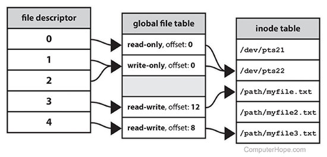

# Linux File Descriptors 
A file descriptor is a number that uniquely identifies an open file in a computer's operating system. It describes a data resource, and how that resource may be accessed.

When a program asks to open a file — or another data resource, like a network socket — the kernel:

Grants access.
Creates an entry in the global file table.
Provides the software with the location of that entry.
The descriptor is identified by a unique non-negative integer, such as 0, 12, or 567. At least one file descriptor exists for every open file on the system.

File descriptors were first used in Unix, and are used by modern operating systems including Linux, macOS, and BSD. In Microsoft Windows, file descriptors are known as file handles.

When a process makes a successful request to open a file, the kernel returns a file descriptor which points to an entry in the kernel's global file table. The file table entry contains information such as the inode of the file, byte offset, and the access restrictions for that data stream (read-only, write-only, etc.).

On a Unix-like operating system, the first three file descriptors, by default, are STDIN (standard input), STDOUT (standard output), and STDERR (standard error).

When the shell runs a program, it opens three files with file descriptors 0, 1, and 2. The default assignments for these descriptors are as follows:

## Descriptor Explanation

        0	Represents standard input.

        1	Represents standard output.

        2	Represents standard error.

### For more information refer the following links 

[File Descriptor Overview](https://bottomupcs.com/ch01s03.html)

[Ampersands and File Descriptors in Bash](https://www.linux.com/training-tutorials/ampersands-and-file-descriptors-bash/)