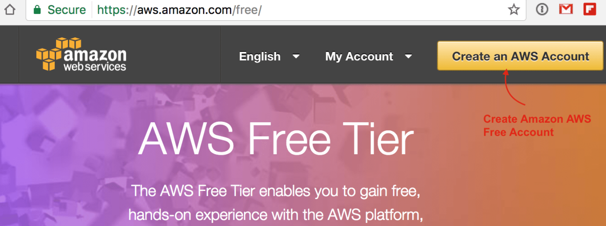
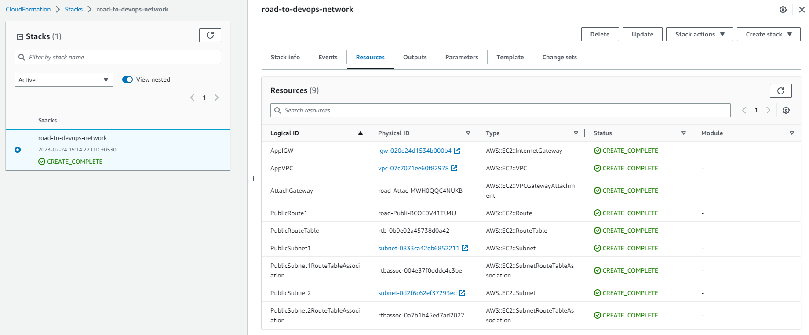
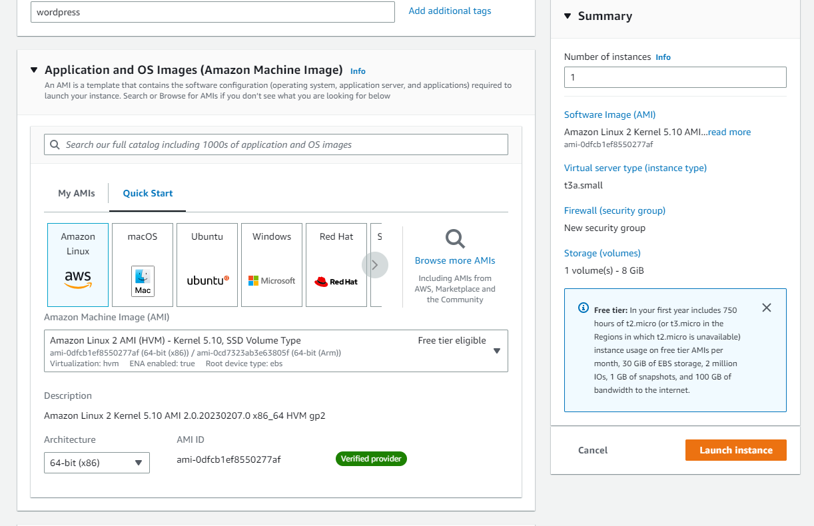
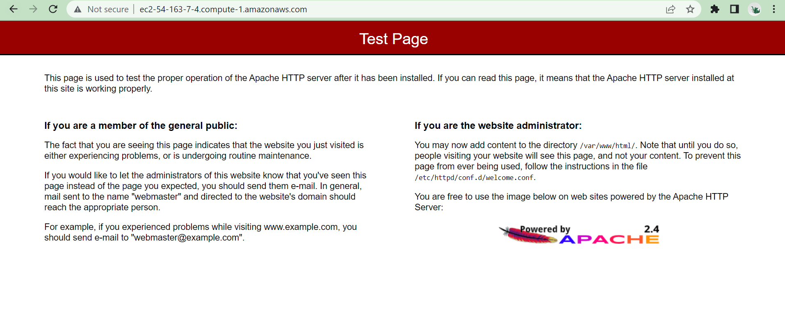
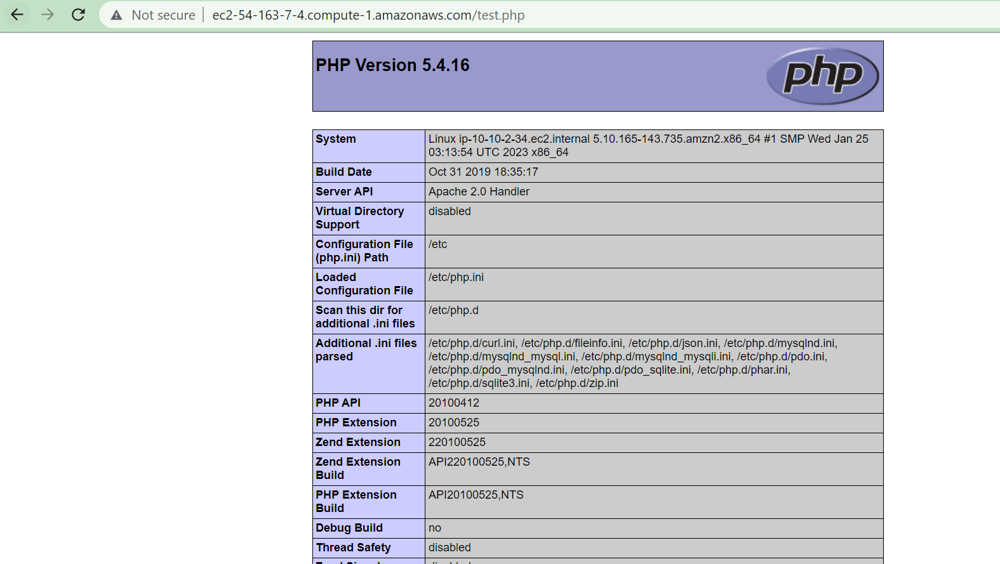
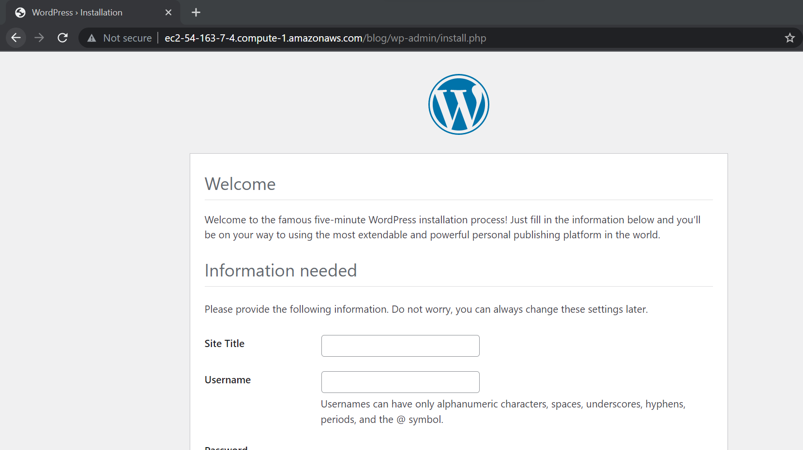
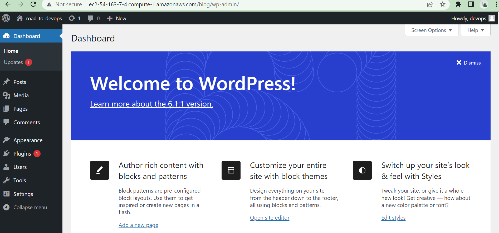

**2-Tier Highly Available WordPress Deployment
**
In this tutorial I’ll show you how you can setup LAMP environment on Linux platform and install WordPress blog manually on Amazon EC2 instance.
**Contents**
- [1. Create an AWS Account](#1-create-an-aws-account)
- [2. Deploy a networking stack](#2-deploy-a-networking-stack)
- [3. Create an Instance](#3-create-an-instance)
- [4. SSH into your Instance](#4-ssh-into-your-instance)
- [5. Install the Apache Web Server to run PHP](#5-install-the-apache-web-server-to-run-php)
- [6. Install PHP to run WordPress](#6-install-php-to-run-wordpress)
- [7. Install MySQL for adding database](#7-install-mysql-for-adding-database)
- [8. Install WordPress](#8-install-wordpress)
- [9. Map IP Address and Domain Name](#9-map-ip-address-and-domain-name)
  - [Other Method: To change your WordPress site URL with the wp-cli](#other-method-to-change-your-wordpress-site-url-with-the-wp-cli)

## 1. Create an AWS Account



First of all you need to create your AWS account. You can sign up by following this link. You will have to provide a credit card or international Debit card and a phone number on which you will be called as part of the online registration verification process as par their terms and policy.

Your credit card or debit card will be charge of minor value and it will be refunded once they verify it. Amazon offers a Free Usage Tier on which we will install WordPress, which is great to explore the services and even host real apps without being charged of single penny.

## 2. Deploy a networking stack 
Now you need to setup an isolated networking environment in which the following AWS resources will be deployed using the cloudFormation template:

- VPC 
- Public Subnets
- Public Route Tables
- IGW 

Firstly save the below in the file named "vpc.yml"
```
AWSTemplateFormatVersion: 2010-09-09
Description: It contains the low grade security Vpc having 2 public subnets.
Metadata: 
  AWS::CloudFormation::Interface: 
    ParameterGroups: 
      - Label: 
          default: "Network Configurations"
        Parameters: 
          - VpcCIDR
          - PublicSubnet1CIDR
          - PublicSubnet2CIDR
Parameters:
  VpcCIDR:
    Description: cidr block for vpc.
    Type: String 
    Default: 10.10.0.0/16
    ConstraintDescription: Must be a valid IP range in x.x.x.x/x notation
  
  PublicSubnet1CIDR:
    Description: Cidr block for public subnet 1.
    Type: String
    Default: 10.10.1.0/24

  PublicSubnet2CIDR:
    Description: Cidr block for public subnet 2.
    Type: String
    Default: 10.10.2.0/24

Resources:

  AppVPC:
    Type: AWS::EC2::VPC  
    Properties:
      CidrBlock: !Ref VpcCIDR 
      EnableDnsSupport: true
      EnableDnsHostnames: true
      Tags:
      - Key: Name
        Value: !Sub vpc-${AWS::StackName}
        
# create a internetgateway 
  AppIGW:
    Type: AWS::EC2::InternetGateway
    DependsOn: AppVPC
    Properties:
      Tags:
      - Key: Name
        Value: !Sub IGW-${AWS::StackName}

  AttachGateway:
    Type: AWS::EC2::VPCGatewayAttachment
    Properties:
      VpcId: !Ref AppVPC
      InternetGatewayId: !Ref AppIGW
  
  # Create 2 public subnet

  PublicSubnet1:
    Type: AWS::EC2::Subnet
    Properties:
      VpcId: !Ref AppVPC
      AvailabilityZone: !Select [ '0', !GetAZs '' ]    # Get the first AZ in the list   
      CidrBlock: !Ref PublicSubnet1CIDR
      Tags:
      - Key: Name
        Value: !Sub Public-Subnet1-${AWS::StackName}
      MapPublicIpOnLaunch: true       #it will assign public ip on launch

  PublicSubnet2:
    Type: AWS::EC2::Subnet
    Properties:
      VpcId:
        Ref: AppVPC
      AvailabilityZone:  !Select [ '1', !GetAZs '' ]    # Get the second AZ in the list 
      CidrBlock: !Ref PublicSubnet2CIDR
      MapPublicIpOnLaunch: true
      Tags:
      - Key: Name
        Value: !Sub Public-Subnet2-${AWS::StackName}

  # Public route table for our subnets:

  PublicRouteTable:
    Type: AWS::EC2::RouteTable
    Properties:
      VpcId: !Ref AppVPC
      Tags:
      - Key: Name
        Value: !Sub PublicRouteTable-${AWS::StackName}

  # Public route table has direct routing to IGW:

  PublicRoute1:  
    Type: AWS::EC2::Route
    DependsOn: AttachGateway
    Properties:
      RouteTableId: !Ref PublicRouteTable
      DestinationCidrBlock: 0.0.0.0/0
      GatewayId: !Ref AppIGW

# Attach the public subnets to public route tables,
  # and attach the private subnets to private route tables:   

  PublicSubnet1RouteTableAssociation:
    Type: AWS::EC2::SubnetRouteTableAssociation
    Properties:
      SubnetId: !Ref PublicSubnet1
      RouteTableId: !Ref PublicRouteTable

  PublicSubnet2RouteTableAssociation:
    Type: AWS::EC2::SubnetRouteTableAssociation
    Properties:
      SubnetId: !Ref PublicSubnet2
      RouteTableId: !Ref PublicRouteTable
  

Outputs:
  VPCID:
    Description: "VPC Id"
    Value: !Ref AppVPC
  Public1:
    Description: Public Subnet1
    Value: !Ref PublicSubnet1
  Public2:
    Description: Public Subnet2
    Value: !Ref PublicSubnet2
```
Now go the cloudFormation section and upload the template as follows 

 

Launch the template after reviewing all the configurations 

  

After successful deployment of the template, check the resources created 

 

 

## 3. Create an Instance

Now we will create an EC2 instance, if you have new blog then you can choose EC2 micro instance which can handle around 200+ real-time traffic.

It has also attractive price structure but if you are migrating your existing blog and having traffic more than thousand per day then you must choose Small instance which can handle that traffic very easily.

To create a new instance, access the AWS Management Console and click the EC2 tab:
- Choose an AMI in the classic instance wizard:

        - I chose the Basic 64-bit Ubuntu Server Amazon Linux AMI.


Instance details:

        - Select the Instance Type you want to use. I chose Small (t3a.small).

 

- Create a new key pair.

        - Enter a name for your key pair (i.e. road-to-devops) and download your key pair (i.e. road-to-devops.pem).

- Select VPC created in step 1 and give security group name 
  


- Launch your instance.

## 4. SSH into your Instance
Once your instance setup is complete and it shows instance is running, you can ssh into it.

First of all, you need to identify the IP Address (public DNS) of your instance:
- Select the instance in the AWS Management Console.
- Look for the Public DNS in the instance description (bottom part of the screen).
- Use that address (and a path to your .pem file) to ssh into your instance:

                ssh ec2-user@ec2-50-17-15-27.compute-1.amazonaws.com -i ~/road-to-devops.pem

If you are on windows system then you should use Putty for connect as SSH. You can connect with putty by following this article.
- If you get an error message about your .pem file permissions being too open, chmod your .pem file as follows:

        [ec2-user ~]$ chmod 400 ~/road-to-devops.pem

In this tutorial you need to perform many shell commands and most of command require root access. So, to avoid this we will prefix these all command with sudo by switching user once for all by this command.

        [ec2-user ~]$ sudo su


## 5. Install the Apache Web Server to run PHP

To install the Apache Web Server, type in terminal:
```
[ec2-user ~]$ sudo yum -y install python-simplejson     # Install PHP latest version
[ec2-user ~]$ sudo yum update                           # System wide upgrade
[ec2-user ~]$ sudo yum install -y default-jre           # Install Java (just to be safe)
[ec2-user ~]$ sudo yum install httpd                    # Install HTTPD server
```


Start the Apache Web Server:

        [ec2-user ~]$ service httpd start


 

After setup, to test your Web Server, allow port 80 in security group from everywhere 

 

open a browser and access your web site:


http://ec2-54-163-7-4.compute-1.amazonaws.com/

 

(Use your actual public DNS name). You should see a standard Amazon place holder default page.

## 6. Install PHP to run WordPress
To install PHP, type in terminal:

        [ec2-user ~]$ yum install php php-mysql


After installing php successfully Restart the Apache Web Server:

        [ec2-user ~]$ service httpd restart


Create a page to test your PHP installation:
```
[ec2-user ~]$ cd /var/www/html
[ec2-user ~]$ vi test.php
```


- Type i to start the insert mode
- Type <?php phpinfo() ?>
- Type :wq to write the file and quit vi
  
Open a browser and access test.php to test your PHP installation:

http://ec2-54-163-7-4.compute-1.amazonaws.com/test.php


 

## 7. Install MySQL for adding database
To install MySQL, type:

```
rpm --import https://repo.mysql.com/RPM-GPG-KEY-mysql-2022
wget http://dev.mysql.com/get/mysql57-community-release-el7-8.noarch.rpm
sudo yum localinstall mysql57-community-release-el7-8.noarch.rpm
sudo yum install mysql-community-server
```

Start MySQL:
```
service mysqld start
```
Now verify the port 3306 on which mysql is running using the following command 

        sudo netstat -nltp


Now check the root password generated by running the following command 
```
sudo grep 'A temporary password is generated for root@localhost' /var/log/mysqld.log |tail -1
```
 

Here the password showed in hash is the the root password "b)IJj-q;F4F8"

After getting the password, run the following command and enter the above password 

```
mysql -u root -p
```
Update the current root password by running the alter command 

```
ALTER USER `root`@`localhost` IDENTIFIED BY 'Roadtodevops12356@@',
       `root`@`localhost` PASSWORD EXPIRE NEVER;
```
 

Create your “blog” database:


## 8. Install WordPress
To install WordPress, type:

        [ec2-user ~]$ cd /var/www/html

        [ec2-user ~]$ wget http://wordpress.org/latest.tar.gz


To uncompress tar.gz file type:

        [ec2-user ~]$ tar -xzvf latest.tar.gzcd


This will uncompress WordPress in its own WordPress directory.
I like having WordPress in a separate directory, but would rather rename it to “blog” if you want to install it to subdomain like “http://your-site.com/blog”:

        [ec2-user ~]$ mv wordpress blog


otherwise move all files to parent folder by typing:

        [ec2-user ~]$ mv *.* ..


Create the WordPress wp-config.php file:
```
[ec2-user ~]$ cd blog
[ec2-user ~]$ mv wp-config-sample.php wp-config.php
[ec2-user ~]$ vi wp-config.php
```


- Type i to start insert mode.
Modify the database connection parameters as follows:

define(‘DB_NAME’, ‘blog’);

define(‘DB_USER’, ‘root’);

define(‘DB_PASSWORD’, ‘YOUR_PASSWORD’);

define(‘DB_HOST’, ‘localhost’);


- Press esc one time then
- Type :wq to write the file and quit vi
-  Open a Browser and access your blog:

http://ec2-54-163-7-4.compute-1.amazonaws.com/blog (Use your public DNS name).

 

This should open the WordPress installation configuration process.

 

 

- Note: If you face issues in php version, kindly update the php version using the following link :
  
  https://www.ezeelogin.com/kb/article/how-to-upgrade-php-to-7-2-on-centos-282.html

- TIP: To allow WordPress to use permalinks

WordPress permalinks need to use Apache .htaccess files to work properly, but this is not enabled by default on Amazon Linux. Use this procedure to allow all overrides in the Apache document root.

Open the httpd.conf file with your favorite text editor (such as nano or vim). If you do not have a favorite text editor, nano is much easier for beginners to use.

        [ec2-user wordpress]$ sudo vim /etc/httpd/conf/httpd.conf


Find the section that starts with <Directory “/var/www/html“>.
<Directory "/var/www/html">
```
#
# Possible values for the Options directive are "None", "All",
# or any combination of:
#   Indexes Includes FollowSymLinks SymLinksifOwnerMatch ExecCGI MultiViews
#
# Note that "MultiViews" must be named *explicitly* --- "Options All"
# doesn't give it to you.
#
# The Options directive is both complicated and important.  Please see
# http://httpd.apache.org/docs/2.4/mod/core.html#options
# for more information.
#
Options Indexes FollowSymLinks
#
# AllowOverride controls what directives may be placed in .htaccess files.
# It can be "All", "None", or any combination of the keywords:
#   Options FileInfo AuthConfig Limit
#
AllowOverride None
#
# Controls who can get stuff from this server.
#
Require all granted
</Directory>
```


Change the AllowOverride None line in the above section to read AllowOverride All.

- Note:
There are multiple AllowOverride lines in this file; be sure you change the line in the <Directory "/var/www/html"> section.
                
                AllowOverride All

Save the file and exit your text editor.


## 9. Map IP Address and Domain Name
To use your blog in production, you will have to:

- Associate an IP address to your instance
- Map your domain name to that IP address
- To associate an IP address to your instance:
Steps:
a. In the AWS Management Console, click Elastic IPs (left navigation bar)

b. Click Allocate New Address, and confirm by clicking the “Yes, Allocate” button

c. Right-click the newly allocated IP address and select “Associate” in the popup menu. Select the instance you just created and click “Yes, Associate”

d. To map your domain name to your IP address, you will have to use the tools provided by your domain registrar.

e. If you use GoDaddy, specify NS73.DOMAINCONTROL.COM and NS74.DOMAINCONTROL.COM as the name servers for your domain, and use the DNS Manager to modify the A record and point to your IP address or

f. If you are using Route 53, then create A record and map it to the EC2 IP address 

 

 

g. Once everything is configured and mapped correctly, access the General Settings in the WordPress management console and make sure the WordPress Address and Site Address are specified correctly using your domain name

### Other Method: To change your WordPress site URL with the wp-cli

Note the old site URL and the new site URL for your instance. The old site URL is likely the public DNS name for your EC2 instance when you installed WordPress. The new site URL is the current public DNS name for your EC2 instance.

If you are not sure of your old site URL, you can use curl to find it with the following command.

                [ec2-user ~]$ curl localhost | grep wp-content


You should see references to your old public DNS name in the output, which will look like this (old site URL in red):

                <script type='text/javascript' src= http://ec2-50-17-15-27.compute-1.amazonaws.com/blog/wp-content/themes/twentyfifteen/js/functions.js?ver=20150330'></script>


Download the wp-cli with the following command.

                [ec2-user ~]$ curl -O https://raw.githubusercontent.com/wp-cli/builds/gh-pages/phar/wp-cli.phar


Search and replace the old site URL in your WordPress installation with the following command. Substitute the old and new site URLs for your EC2 instance and the path to your WordPress installation (usually /var/www/html or /var/www/html/blog).

                [ec2-user ~]$ php wp-cli.phar search-replace 'old_site_url' 'new_site_url' --path=/path/to/wordpress/installation --skip-columns=guid


In a web browser, enter the new site URL of your WordPress blog to verify that the site is working properly again.
That’s it.

You have successfully created LAMP environment and installed WordPress on Amazon EC2.