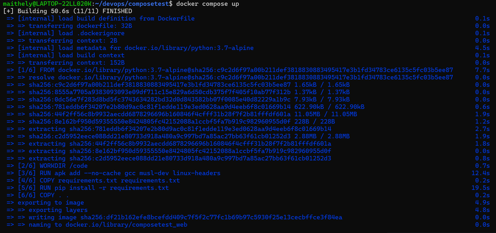

# About Docker Compose & Use cases.
Docker Compose is a tool that was developed to help define and share multi-container applications. With Compose, we can create a YAML file to define the services and with a single command, can spin everything up or tear it all down.

1. with Compose, you use a YAML file to configure your application’s services. Then, with a single command, you create and start all the services from your configuration.
- All of your configuration in one file
- Compose revolves around a config file called docker-compose.yml. In it we define all of our services. Think of a service as a part of your application; a database or API for example.
- All of our services rely on an image with which we create a container. Spinning up a container can have many options; how these options are configured will be stored in the yml file.

2. What can docker compose do?
- Start, stop, and rebuild services
- View the status of running services
- Stream the log output of running services
- Run a one-off command on a service

3. Key Features of Compose
- Have multiple isolated environments on a single host
- Preserves volume data when containers are created
- Only recreate containers that have changed
- Supports variables and moving a composition between environments

4. Practice docker-compose using the following example 
## Prerequisites
- Install Docker Engine and Docker Compose as standalone binaries
- Install Docker Desktop which includes both Docker Engine and Docker Compose
- You don’t need to install Python or Redis, as both are provided by Docker images.

## Step 1: Define the application dependencies

1.1 Create a directory for the project:
```
$ mkdir composetest
$ cd composetest
```

1.2 Create a file called “app.py” in your project directory
```
import time

import redis
from flask import Flask

app = Flask(__name__)
cache = redis.Redis(host='redis', port=6379)

def get_hit_count():
    retries = 5
    while True:
        try:
            return cache.incr('hits')
        except redis.exceptions.ConnectionError as exc:
            if retries == 0:
                raise exc
            retries -= 1
            time.sleep(0.5)

@app.route('/')
def hello():
    count = get_hit_count()
    return 'Hello World! I have been seen {} times.\n'.format(count)
```
1.3 Create another file called “requirements.txt”
```
flask
redis
```
## Step 2: Create a Dockerfile

Dockerfile
```
FROM python:3.7-alpine
WORKDIR /code
ENV FLASK_APP=app.py
ENV FLASK_RUN_HOST=0.0.0.0
RUN apk add --no-cache gcc musl-dev linux-headers
COPY requirements.txt requirements.txt
RUN pip install -r requirements.txt
EXPOSE 5000
COPY . .
CMD ["flask", "run"]
```
This tells Docker to:
- Build an image starting with the Python 3.7 image.
- Set the working directory to /code.
- Set environment variables used by the flask command.
- Install gcc and other dependencies
- Copy requirements.txt and install the Python dependencies.
- Add metadata to the image to describe that the container is listening on port 5000
- Copy the current directory . in the project to the workdir . in the image.
- Set the default command for the container to flask run.

## Step 3: Define services in a Compose file🔗

Create a file with name docker-compose.yml and paste the following configurations:

```
version: "3.9"
services:
  web:
    build: .
    ports:
      - "8000:5000"
  redis:
    image: "redis:alpine"
```
## Step 4: Build and run your app with Compose🔗

        docker compose up

 

```
Creating network "composetest_default" with the default driver
Creating composetest_web_1 ...
Creating composetest_redis_1 ...
Creating composetest_web_1
Creating composetest_redis_1 ... done
Attaching to composetest_web_1, composetest_redis_1
web_1    |  * Running on http://0.0.0.0:5000/ (Press CTRL+C to quit)
redis_1  | 1:C 17 Aug 22:11:10.480 # oO0OoO0OoO0Oo Redis is starting oO0OoO0OoO0Oo
redis_1  | 1:C 17 Aug 22:11:10.480 # Redis version=4.0.1, bits=64, commit=00000000, modified=0, pid=1, just started
redis_1  | 1:C 17 Aug 22:11:10.480 # Warning: no config file specified, using the default config. In order to specify a config file use redis-server /path/to/redis.conf
web_1    |  * Restarting with stat
redis_1  | 1:M 17 Aug 22:11:10.483 * Running mode=standalone, port=6379.
redis_1  | 1:M 17 Aug 22:11:10.483 # WARNING: The TCP backlog setting of 511 cannot be enforced because /proc/sys/net/core/somaxconn is set to the lower value of 128.
web_1    |  * Debugger is active!
redis_1  | 1:M 17 Aug 22:11:10.483 # Server initialized
redis_1  | 1:M 17 Aug 22:11:10.483 # WARNING you have Transparent Huge Pages (THP) support enabled in your kernel. This will create latency and memory usage issues with Redis. To fix this issue run the command 'echo never > /sys/kernel/mm/transparent_hugepage/enabled' as root, and add it to your /etc/rc.local in order to retain the setting after a reboot. Redis must be restarted after THP is disabled.
web_1    |  * Debugger PIN: 330-787-903
redis_1  | 1:M 17 Aug 22:11:10.483 * Ready to accept connections
```

Enter http://localhost:8000/ in a browser to see the application running

 

For more information:
[Beginners guide on Docker-compose ](https://towardsdatascience.com/docker-compose-for-absolute-beginners-how-does-it-work-and-how-to-use-it-examples-733ca24c5e6c)