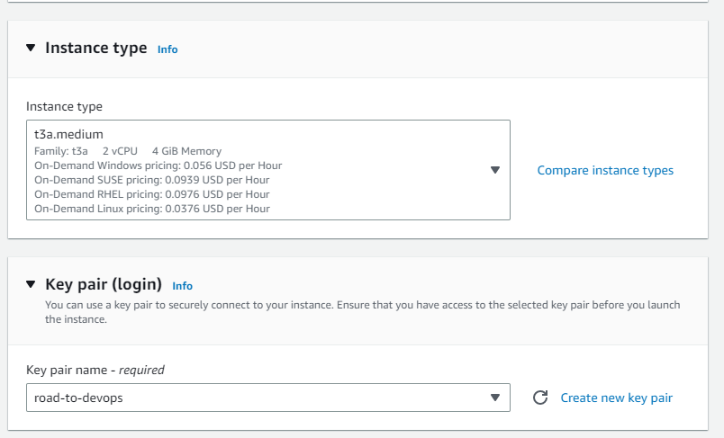
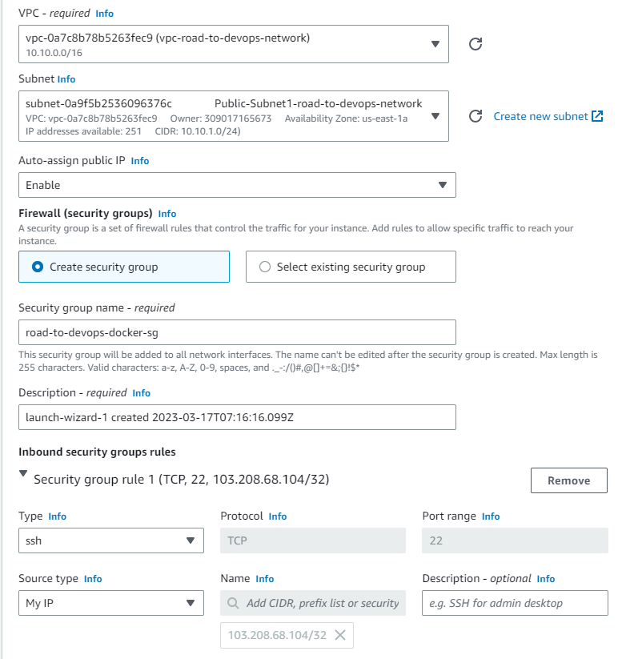
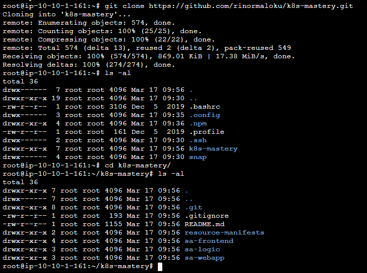
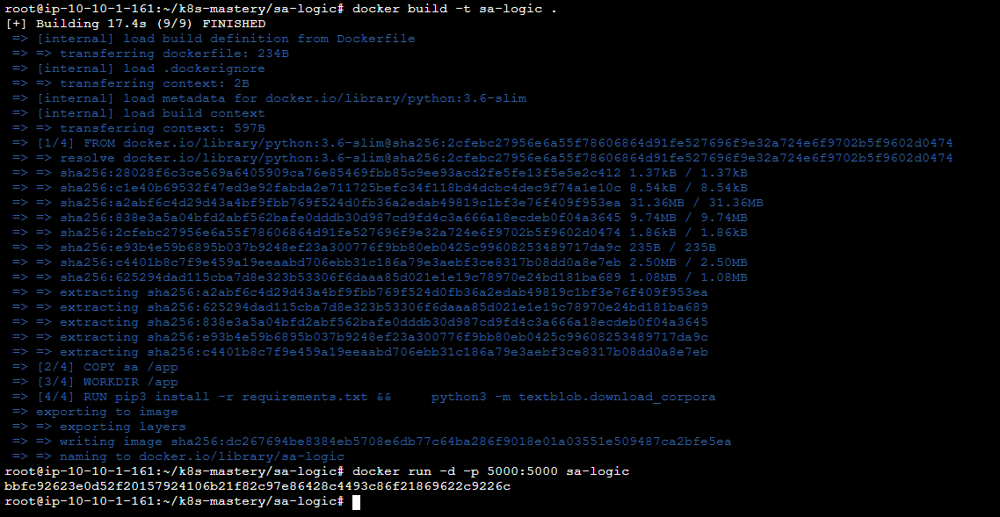
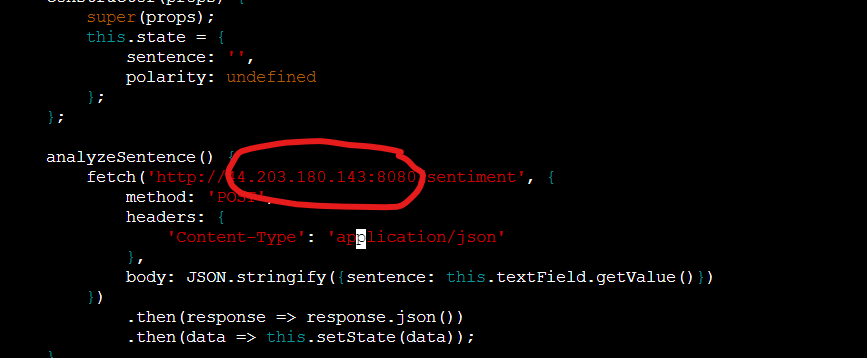
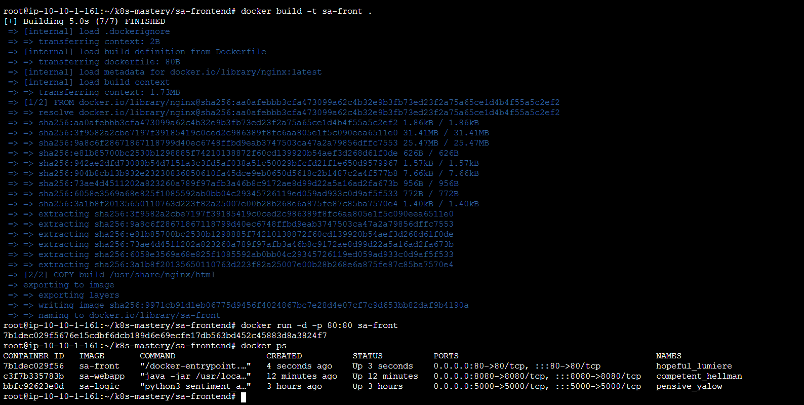
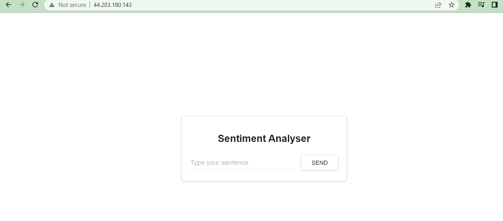
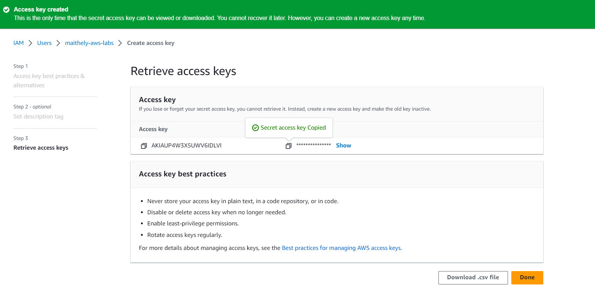
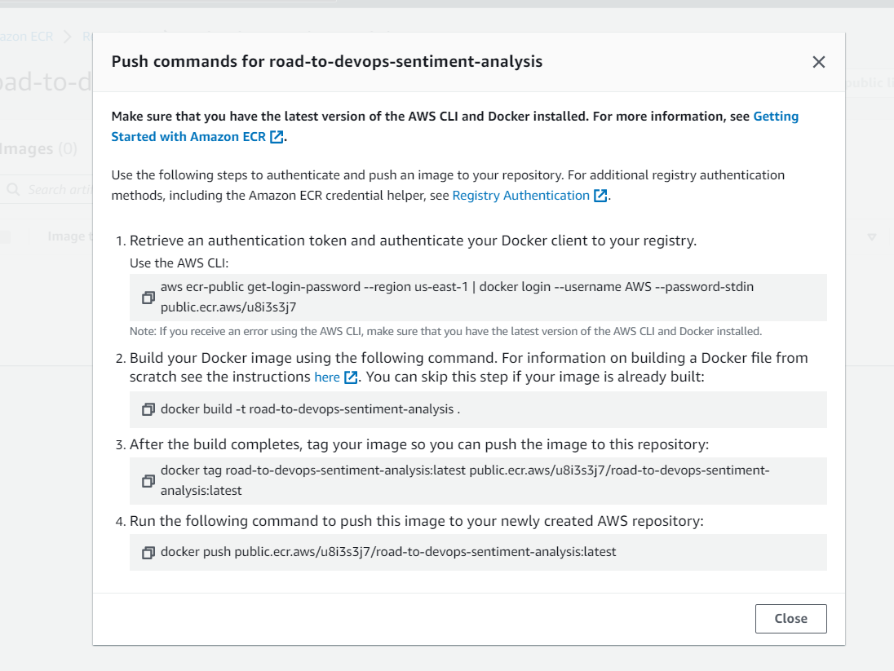
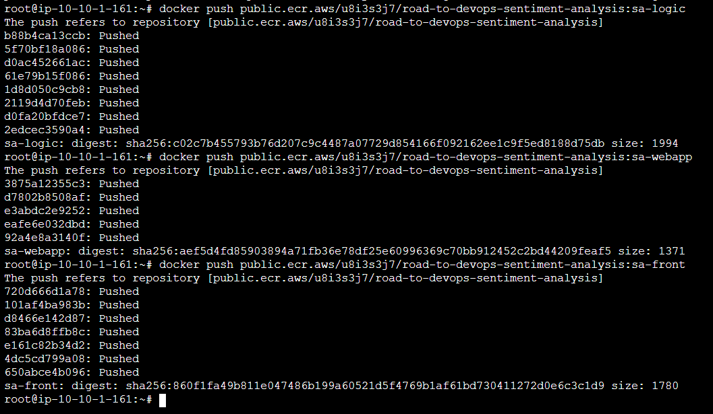

## Docker Container Hands-on 
In this Article we will be Building container images for each service of the Microservice application.
The code for all of these applications can be found in this [repository](https://github.com/sq-ldc/sentiment-analyzer-example-app). I recommend cloning it immediately because we are going to build amazing things together.

**note: This tutorial assume the reader knows about application development, Microservices, and Docker containers.**

From the technical perspective, the application consists of three microservices. Each has one specific functionality:

- **SA-Frontend**: a Nginx web server that serves our ReactJS static files.

- **SA-WebApp**: a Java Web Application that handles requests from the frontend.

- **SA-Logic**: a python application that performs Sentiment Analysis.

It’s important to know that Microservices don’t live in isolation, they enable “separation of concerns” but they still have to interact with each other.

This interaction is best illustrated by showing how the data flows between them:
1. A client application requests the index.html (which in turn requests bundled scripts of ReactJS application)
2. The user interacting with the application triggers requests to the Spring WebApp.
3. Spring WebApp forwards the requests for sentiment analysis to the Python app.
4. Python Application calculates the sentiment and returns the result as a response.
5. The Spring WebApp returns the response to the React app. (Which then represents the information to the user.)

Now let us start with the tutorial, the initial step is to create an isolated networking environment 

## STEP 1: Deploy a network stack 

Here we will deploy minimal networking resources for the sandbox environment.

**Note: It is not advisable to use this stack for production environments, this is only for learning purpose**

Using MINIMAL VPC stack the following AWS resources will be deployed 

- VPC 
- Public Subnets
- Public Route Tables
- IGW 

Firstly save the below yaml in the file named "vpc_minimal.yml"
```
AWSTemplateFormatVersion: 2010-09-09
Description: It contains the low grade security Vpc having 2 public subnets.
Metadata: 
  AWS::CloudFormation::Interface: 
    ParameterGroups: 
      - Label: 
          default: "Network Configurations"
        Parameters: 
          - VpcCIDR
          - PublicSubnet1CIDR
          - PublicSubnet2CIDR
Parameters:
  VpcCIDR:
    Description: cidr block for vpc.
    Type: String 
    Default: 10.10.0.0/16
    ConstraintDescription: Must be a valid IP range in x.x.x.x/x notation
  
  PublicSubnet1CIDR:
    Description: Cidr block for public subnet 1.
    Type: String
    Default: 10.10.1.0/24

  PublicSubnet2CIDR:
    Description: Cidr block for public subnet 2.
    Type: String
    Default: 10.10.2.0/24

Resources:

  AppVPC:
    Type: AWS::EC2::VPC  
    Properties:
      CidrBlock: !Ref VpcCIDR 
      EnableDnsSupport: true
      EnableDnsHostnames: true
      Tags:
      - Key: Name
        Value: !Sub vpc-${AWS::StackName}
        
# create a internetgateway 
  AppIGW:
    Type: AWS::EC2::InternetGateway
    DependsOn: AppVPC
    Properties:
      Tags:
      - Key: Name
        Value: !Sub IGW-${AWS::StackName}

  AttachGateway:
    Type: AWS::EC2::VPCGatewayAttachment
    Properties:
      VpcId: !Ref AppVPC
      InternetGatewayId: !Ref AppIGW
  
  # Create 2 public subnet

  PublicSubnet1:
    Type: AWS::EC2::Subnet
    Properties:
      VpcId: !Ref AppVPC
      AvailabilityZone: !Select [ '0', !GetAZs '' ]    # Get the first AZ in the list   
      CidrBlock: !Ref PublicSubnet1CIDR
      Tags:
      - Key: Name
        Value: !Sub Public-Subnet1-${AWS::StackName}
      MapPublicIpOnLaunch: true       #it will assign public ip on launch

  PublicSubnet2:
    Type: AWS::EC2::Subnet
    Properties:
      VpcId:
        Ref: AppVPC
      AvailabilityZone:  !Select [ '1', !GetAZs '' ]    # Get the second AZ in the list 
      CidrBlock: !Ref PublicSubnet2CIDR
      MapPublicIpOnLaunch: true
      Tags:
      - Key: Name
        Value: !Sub Public-Subnet2-${AWS::StackName}

  # Public route table for our subnets:

  PublicRouteTable:
    Type: AWS::EC2::RouteTable
    Properties:
      VpcId: !Ref AppVPC
      Tags:
      - Key: Name
        Value: !Sub PublicRouteTable-${AWS::StackName}

  # Public route table has direct routing to IGW:

  PublicRoute1:  
    Type: AWS::EC2::Route
    DependsOn: AttachGateway
    Properties:
      RouteTableId: !Ref PublicRouteTable
      DestinationCidrBlock: 0.0.0.0/0
      GatewayId: !Ref AppIGW

# Attach the public subnets to public route tables,
  # and attach the private subnets to private route tables:   

  PublicSubnet1RouteTableAssociation:
    Type: AWS::EC2::SubnetRouteTableAssociation
    Properties:
      SubnetId: !Ref PublicSubnet1
      RouteTableId: !Ref PublicRouteTable

  PublicSubnet2RouteTableAssociation:
    Type: AWS::EC2::SubnetRouteTableAssociation
    Properties:
      SubnetId: !Ref PublicSubnet2
      RouteTableId: !Ref PublicRouteTable
  

Outputs:
  VPCID:
    Description: "VPC Id"
    Value: !Ref AppVPC
  Public1:
    Description: Public Subnet1
    Value: !Ref PublicSubnet1
  Public2:
    Description: Public Subnet2
    Value: !Ref PublicSubnet2
```
Now go the cloudFormation section and upload the template as follows 

 

Launch the template after reviewing all the configurations 

  

After successful deployment of the template, check the resources created 

 

 

## STEP 2: Create an EC2 instance 

1. Click on **Launch an Instance** on the EC2 dashboard and then enter the **Name** of the instance and choose **Ubuntu 20** as AMI



2. Choose instance type as **t3a.medium** and choose the **Key Pair** which you are using 


3. Choose the VPC, created in STEP 1 **road-to-devops-network** and then choose the **Public Subnet**



**Make sure you have allowed port 22 from "MyIp" only**

4. Choose EBS volume size as **8 gb** and if you're using SSM to connect to EC2 instance, then choose the required role 


## Step 3: Install Dependencies on EC2 instance

Now SSH into the instance and run  the following commands 

### NodeJs Dependencies 

```
apt update
apt install net-tools -y
curl -fsSL https://deb.nodesource.com/setup_14.x | sudo -E bash -
apt-get install gcc make -y
apt-get install nodejs -y 
```

Verify node and npm version 


### Docker dependencies

```
sudo apt update
sudo apt install apt-transport-https ca-certificates curl software-properties-common
curl -fsSL https://download.docker.com/linux/ubuntu/gpg | sudo apt-key add -
sudo add-apt-repository "deb [arch=amd64] https://download.docker.com/linux/ubuntu focal stable"
apt-cache policy docker-ce
sudo apt install docker-ce
sudo systemctl status docker

```
Verify the docker version installed 


## STEP 4: Clone the code from GitHub

    git clone https://github.com/rinormaloku/k8s-mastery.git



## STEP 5: Build the image and spun up Docker Container for microservices 


### sa-logic 

Run the following commands to build **sa-logic** image and run the container on port 5000

```
cd k8s-mastery/sa-logic
docker build -t sa-logic .
docker run -d -p 5000:5000 sa-logic
```



Now Check the the docker image and docker container spunned up by running the following commands


After running logic container run below command and check the IP address of the logic container (check the network settings at the bottom after running the inspect command)

    docker inspect <container id>

```
root@ip-10-10-1-161:~/k8s-mastery/sa-logic# docker inspect bbf
[
    {
        "Id": "bbfc92623e0d52f20157924106b21f82c97e86428c4493c86f21869622c9226c",
        "Created": "2023-03-17T10:04:34.889230376Z",
        "Path": "python3",
        "Args": [
            "sentiment_analysis.py"
        ],
        "State": {
            "Status": "running",
            "Running": true,
            "Paused": false,
            "Restarting": false,
            "OOMKilled": false,
            "Dead": false,
            "Pid": 10143,
            "ExitCode": 0,
            "Error": "",
            "StartedAt": "2023-03-17T10:04:35.446073366Z",
            "FinishedAt": "0001-01-01T00:00:00Z"
        },
        "Image": "sha256:dc267694be8384eb5708e6db77c64ba286f9018e01a03551e509487ca2bfe5ea",
        "ResolvConfPath": "/var/lib/docker/containers/bbfc92623e0d52f20157924106b21f82c97e86428c4493c86f21869622c9226c/resolv.conf",
        "HostnamePath": "/var/lib/docker/containers/bbfc92623e0d52f20157924106b21f82c97e86428c4493c86f21869622c9226c/hostname",
        "HostsPath": "/var/lib/docker/containers/bbfc92623e0d52f20157924106b21f82c97e86428c4493c86f21869622c9226c/hosts",
        "LogPath": "/var/lib/docker/containers/bbfc92623e0d52f20157924106b21f82c97e86428c4493c86f21869622c9226c/bbfc92623e0d52f20157924106b21f82c97e86428c4493c86f21869622c9226c-json.log",
        "Name": "/pensive_yalow",
        "RestartCount": 0,
        "Driver": "overlay2",
        "Platform": "linux",
        "MountLabel": "",
        "ProcessLabel": "",
        "AppArmorProfile": "docker-default",
        "ExecIDs": null,
        "HostConfig": {
            "Binds": null,
            "ContainerIDFile": "",
            "LogConfig": {
                "Type": "json-file",
                "Config": {}
            },
            "NetworkMode": "default",
            "PortBindings": {
                "5000/tcp": [
                    {
                        "HostIp": "",
                        "HostPort": "5000"
                    }
                ]
            },
            "RestartPolicy": {
                "Name": "no",
                "MaximumRetryCount": 0
            },
            "AutoRemove": false,
            "VolumeDriver": "",
            "VolumesFrom": null,
            "ConsoleSize": [
                50,
                209
            ],
            "CapAdd": null,
            "CapDrop": null,
            "CgroupnsMode": "host",
            "Dns": [],
            "DnsOptions": [],
            "DnsSearch": [],
            "ExtraHosts": null,
            "GroupAdd": null,
            "IpcMode": "private",
            "Cgroup": "",
            "Links": null,
            "OomScoreAdj": 0,
            "PidMode": "",
            "Privileged": false,
            "PublishAllPorts": false,
            "ReadonlyRootfs": false,
            "SecurityOpt": null,
            "UTSMode": "",
            "UsernsMode": "",
            "ShmSize": 67108864,
            "Runtime": "runc",
            "Isolation": "",
            "CpuShares": 0,
            "Memory": 0,
            "NanoCpus": 0,
            "CgroupParent": "",
            "BlkioWeight": 0,
            "BlkioWeightDevice": [],
            "BlkioDeviceReadBps": [],
            "BlkioDeviceWriteBps": [],
            "BlkioDeviceReadIOps": [],
            "BlkioDeviceWriteIOps": [],
            "CpuPeriod": 0,
            "CpuQuota": 0,
            "CpuRealtimePeriod": 0,
            "CpuRealtimeRuntime": 0,
            "CpusetCpus": "",
            "CpusetMems": "",
            "Devices": [],
            "DeviceCgroupRules": null,
            "DeviceRequests": null,
            "MemoryReservation": 0,
            "MemorySwap": 0,
            "MemorySwappiness": null,
            "OomKillDisable": false,
            "PidsLimit": null,
            "Ulimits": null,
            "CpuCount": 0,
            "CpuPercent": 0,
            "IOMaximumIOps": 0,
            "IOMaximumBandwidth": 0,
            "MaskedPaths": [
                "/proc/asound",
                "/proc/acpi",
                "/proc/kcore",
                "/proc/keys",
                "/proc/latency_stats",
                "/proc/timer_list",
                "/proc/timer_stats",
                "/proc/sched_debug",
                "/proc/scsi",
                "/sys/firmware"
            ],
            "ReadonlyPaths": [
                "/proc/bus",
                "/proc/fs",
                "/proc/irq",
                "/proc/sys",
                "/proc/sysrq-trigger"
            ]
        },
        "GraphDriver": {
            "Data": {
                "LowerDir": "/var/lib/docker/overlay2/16d1ce07563934e7fe3649e381ab8aa8c20989d2978340eeac734834fc32f3ae-init/diff:/var/lib/docker/overlay2/l0r8yr7olj3xw9pajvsi83w9l/diff:/var/lib/docker/overlay2/vbcn4izruwkwofv4e2e5u6423/diff:/var/lib/docker/overlay2/5lyy6dfcbosrvxp242w7kf3h2/diff:/var/lib/docker/overlay2/d883635f7819779fcaba1f39d6df4df4e78f01e8ee11d24e983dd2866d97f390/diff:/var/lib/docker/overlay2/ca39fe17ea39503a3162d20afa9df3917aff2ba42144977e801eabb0193e246f/diff:/var/lib/docker/overlay2/5b44b0fb96baebe1c96875dfa3bd7cd2fb5c6b4f72781643e24e2707994f815c/diff:/var/lib/docker/overlay2/520e830029ff1d9d2808f3b2eb47604bab21633245108333f793ca5a8d907c09/diff:/var/lib/docker/overlay2/a993bbdea12f1ea82e47d5dca41e1c7081cd93712b5c558f617d54ed67b4c917/diff",
                "MergedDir": "/var/lib/docker/overlay2/16d1ce07563934e7fe3649e381ab8aa8c20989d2978340eeac734834fc32f3ae/merged",
                "UpperDir": "/var/lib/docker/overlay2/16d1ce07563934e7fe3649e381ab8aa8c20989d2978340eeac734834fc32f3ae/diff",
                "WorkDir": "/var/lib/docker/overlay2/16d1ce07563934e7fe3649e381ab8aa8c20989d2978340eeac734834fc32f3ae/work"
            },
            "Name": "overlay2"
        },
        "Mounts": [],
        "Config": {
            "Hostname": "bbfc92623e0d",
            "Domainname": "",
            "User": "",
            "AttachStdin": false,
            "AttachStdout": false,
            "AttachStderr": false,
            "ExposedPorts": {
                "5000/tcp": {}
            },
            "Tty": false,
            "OpenStdin": false,
            "StdinOnce": false,
            "Env": [
                "PATH=/usr/local/bin:/usr/local/sbin:/usr/local/bin:/usr/sbin:/usr/bin:/sbin:/bin",
                "LANG=C.UTF-8",
                "GPG_KEY=0D96DF4D4110E5C43FBFB17F2D347EA6AA65421D",
                "PYTHON_VERSION=3.6.15",
                "PYTHON_PIP_VERSION=21.2.4",
                "PYTHON_SETUPTOOLS_VERSION=57.5.0",
                "PYTHON_GET_PIP_URL=https://github.com/pypa/get-pip/raw/3cb8888cc2869620f57d5d2da64da38f516078c7/public/get-pip.py",
                "PYTHON_GET_PIP_SHA256=c518250e91a70d7b20cceb15272209a4ded2a0c263ae5776f129e0d9b5674309"
            ],
            "Cmd": [
                "sentiment_analysis.py"
            ],
            "Image": "sa-logic",
            "Volumes": null,
            "WorkingDir": "/app",
            "Entrypoint": [
                "python3"
            ],
            "OnBuild": null,
            "Labels": {}
        },
        "NetworkSettings": {
            "Bridge": "",
            "SandboxID": "f6fc2cc9bc62921bc20491ce94865aa4b573b1bbdc2e1a9409cbfb3aaaa6600e",
            "HairpinMode": false,
            "LinkLocalIPv6Address": "",
            "LinkLocalIPv6PrefixLen": 0,
            "Ports": {
                "5000/tcp": [
                    {
                        "HostIp": "0.0.0.0",
                        "HostPort": "5000"
                    },
                    {
                        "HostIp": "::",
                        "HostPort": "5000"
                    }
                ]
            },
            "SandboxKey": "/var/run/docker/netns/f6fc2cc9bc62",
            "SecondaryIPAddresses": null,
            "SecondaryIPv6Addresses": null,
            "EndpointID": "dd9ba3c10f4d4bc23e36cf3d5fad2d4a9037934d45c509eb246d8ad094c90f7a",
            "Gateway": "172.17.0.1",
            "GlobalIPv6Address": "",
            "GlobalIPv6PrefixLen": 0,
            "IPAddress": "172.17.0.2",
            "IPPrefixLen": 16,
            "IPv6Gateway": "",
            "MacAddress": "02:42:ac:11:00:02",
            "Networks": {
                "bridge": {
                    "IPAMConfig": null,
                    "Links": null,
                    "Aliases": null,
                    "NetworkID": "ff6b0c875d6ce3a6b2a105ea6d67c259ab32b73ee191893e296d88cd4ff6d076",
                    "EndpointID": "dd9ba3c10f4d4bc23e36cf3d5fad2d4a9037934d45c509eb246d8ad094c90f7a",
                    "Gateway": "172.17.0.1",
                    "IPAddress": "172.17.0.2",
                    "IPPrefixLen": 16,
                    "IPv6Gateway": "",
                    "GlobalIPv6Address": "",
                    "GlobalIPv6PrefixLen": 0,
                    "MacAddress": "02:42:ac:11:00:02",
                    "DriverOpts": null
                }
            }
        }
    }
]
```
Here the IP address of the logic container is 172.17.0.2. Copy the IP address of that container and paste this IP in the Dockerfile of webapp at the ENV SA_LOGIC_API_URL 

### sa-webapp

Now go the webapp directory and update the Dockerfile 
```
cd k8s-mastery/sa-webpp
sudo vim Dockerfile
```


Build the Dockerfile 

```
docker build -t sa-webapp .
```
Run the following command to run the webapp container 
    
    docker run -d -p 8080:8080 -e SA_LOGIC_API_URL='http://<container_ip or docker machine ip>:5000' <image name>

So we have passed again the container IP here

    docker run -d -p 8080:8080 -e SA_LOGIC_API_URL='http://172.17.0.2:5000' sa-webapp

Now verify the docker containers running 


### sa-frontend

Now time to build the image for frontend and spun up the container from it. Go to the frontend directory and follow the below steps 

```
cd k8s-mastery/sa-frontend/src
sudo  nano App.js
```
Paste the public ip of instance at the highlighted part in image with port 8080



Go to the sa-frontend directory 

```
cd ..
sudo npm install
sudo npm run build
```


Build the image for frontend and spun up a container from it 

```
docker build -t sa-front .
docker run -d -p 80:80 sa-front
```
Now check the docker spunned up 



Copy the public IP of instance and paste this in browser your app will work. Make sure you have allowed port 80,5000 and 8080 in the security group.




Now enter a sentence to verify the application 


## STEP 7: Push the docker images in the ECR or Docker hub 

Firstly Install AWSCLI on the EC2 instance by running the following commands 

```
apt install unzip 
curl "https://awscli.amazonaws.com/awscli-exe-linux-x86_64.zip" -o "awscliv2.zip"
unzip awscliv2.zip
sudo ./aws/install
```
Verify the AWSCLI version 


Now go to IAM section on the AWS CONSOLE and generate the AWS ACCESS KEYS, click on **Create access key**


Choose **CLI** and click on next. Then download the AWS ACCESS KEY and SECRET KEY 



Now run the following command on the EC2 Instance and enter the KEYS accordingly 

    aws configure 


We will push the images in the AWS ECR public repository. So go to **ECR** and click on **Create Repository**. 

Choose **public** ECR and enter the name of the repository, then click on **Create Repository**


Now check that repository has been created successfully 


Go to **view push commands** in the ECR repository created 




Run the following commands for login 

```
aws ecr-public get-login-password --region us-east-1 | docker login --username AWS --password-stdin public.ecr.aws/u8i3s3j7
```

Now check the Docker images on the ec2 by running the command 

    docker images 


Tag the images as follows 

```
docker tag sa-front:latest public.ecr.aws/u8i3s3j7/road-to-devops-sentiment-analysis:sa-front
docker tag sa-webapp:latest public.ecr.aws/u8i3s3j7/road-to-devops-sentiment-analysis:sa-webapp
docker tag sa-logic:latest public.ecr.aws/u8i3s3j7/road-to-devops-sentiment-analysis:sa-logic
```


Push the images in ECR using the following command 

    docker push imagename 



Verify in ECR that images are pushed successfully 


**note: If you face issues while pushing so check the required permissions to your AWS user**

In this section, we learned about the Dockerfile, how to use it to build an image, and the commands to push it to the Docker registry. 