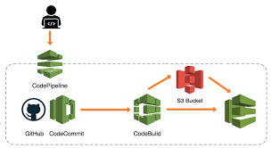

# Code Pipeline 

AWS CodePipeline is a continuous delivery service you can use to model, visualize, and automate the steps required to release your software. You can quickly model and configure the different stages of a software release process. CodePipeline automates the steps required to release your software changes continuously.

Here is the flow of code pipeline 

Codepipeline comprises of 3 stages 

1. Source stage : This stage is pretty straightforward — it is where we start writing code for the project. Effectively, we're getting ready to build a testable product. However, since writing code can take a lot of time, this is a prime opportunity to maximize automation tools.

2. Build stage : In the Build stage, we take the provided code and build it for testing purposes. The code is built in a development environment to allow testing and bug fixes.

3. Deploy stage : Deployment is the stage where we move the project — in its current state - to the production environment for the end-users to access. This stage is where approved changes get deployed to the consumer/user.

Each phase adds value to the code and evaluates it for success before it moves on. Should there be a failure along the flow, the pipeline stops, developers receive the feedback, and they work to fix the issue.

But here’s the thing. A DevOps pipeline isn’t a start-to-finish line. It is a loop, a continuous process of delivering better software faster. The DevOps pipeline actually looks a lot like this:

## What Are the Benefits Of A DevOps Pipeline?
The main benefit of using a DevOps pipeline is that it helps build, deploy, and maintain high-quality software that is always up-to-date, secure, and cost-efficient. Among the other benefits of adopting a robust DevOps pipeline are:

- Maintain a solid yet dynamic workflow to produce consistent deliverables across different stakeholders in the software development lifecycle.
- Build and roll out high-quality software through extensive and well-organized collaboration.
- Release new features, fixes, and updates faster.
- Leverage automation to deliver high-quality software frequently.
- Capture potential issues early to prevent application clashes in production.
- Continuously improve the product throughout its lifetime, ensuring it works for users and is up-to-date, secure, compliant, cost-efficient, etc.

Now, these are great results to have. So, how do you create a robust DevOps pipeline step-by-step?

**Check the next blog in which we are deploying CI-CD pipeline with each steps on AWS platform**