# Hands-on example of creating CODE PIPELINE from scratch: 

# Contents
- [Hands-on example of creating CODE PIPELINE from scratch:](#hands-on-example-of-creating-code-pipeline-from-scratch)
- [Contents](#contents)
- [Overview](#overview)
  - [Step - 1: Setup Wordpress on EC2](#step---1-setup-wordpress-on-ec2)
  - [Step - 2: Upload Source code on Github](#step---2-upload-source-code-on-github)
  - [Step – 3: Create Code Pipeline](#step--3-create-code-pipeline)
    - [Create a Code Deploy service role](#create-a-code-deploy-service-role)
    - [Create Code Deploy Application](#create-code-deploy-application)
    - [Create Source stage](#create-source-stage)
      - [Connecting using Github Version 1](#connecting-using-github-version-1)
      - [Connecting using Github Version 2](#connecting-using-github-version-2)
    - [Create Build Stage](#create-build-stage)
    - [Create Code Deploy stage](#create-code-deploy-stage)

# Overview

AWS Services used are as follows:

1. GitHub as Source

2. AWS CodeBuild for building the artifact using buildspec.yml file

3. S3 Bucket to store the artifact

4. AWS CodeDeploy for deploying the configuration present in the artifact from AWS CodeBuild using appspec.yml file

5. AWS CodePipeline

**note: Codepipeline comprises on three stages i.e source, build and deploy.**

If you're following the tutorial Module wise so as of now, your WordPress website must be up and running. If not, please setup the wordpress on EC2 and then proceed with further steps  

## Step - 1: Setup Wordpress on EC2

Using this blog, you can setup the [WordPress Website](https://github.com/squareops/road-to-devops/blob/develop/Level-2/M2-WebApp2TierHA/L01-WorpressHA.md)

## Step - 2: Upload Source code on Github 

- For this example we have taken source code from squareops-road-to-devops-wordpress-repository (https://github.com/AadeshBhardwaj/wordpress-ci-cd )


                git clone 

## Step – 3: Create Code Pipeline 

Code pipeline consists of 3 main stages i.e 

**1. Source**   

**2. Build**

**3. Deploy**   

### Create a Code Deploy service role 

1. Sign in to the AWS Management Console and open the IAM console at https://console.aws.amazon.com/iam/.

2. In the navigation pane, choose Roles, and then choose Create role.

3. On the Create role page, choose AWS service, and from the Choose the service that will use this role list, choose CodeDeploy.From Select your use case, choose your use case:

- For EC2/On-Premises deployments, choose CodeDeploy.

- For Amazon ECS deployments, choose CodeDeploy - ECS.

- For AWS Lambda deployments, choose CodeDeploy for Lambda.

4. Choose Next: Permissions.

5. On the Attached permissions policy page, the permission policy is displayed. Choose Next: Tags.

6. On the Review page, in Role name, enter a name for the service role (for example, CodeDeployServiceRole), and then choose Create role.

7. You can also enter a description for this service role in Role description.

8. If you want this service role to have permission to access all currently supported endpoints, you are finished with this procedure.

9. To restrict this service role from access to some endpoints, in the list of roles, browse to and choose the role you created, and continue to the next step.

10. On the Trust relationships tab, choose Edit trust relationship.

You should see the following policy, which provides the service role permission to access all supported endpoints:

```
{
    "Version": "2012-10-17",
    "Statement": [
        {
            "Sid": "",
            "Effect": "Allow",
            "Principal": {
                "Service": [
                    "codedeploy.amazonaws.com"
                ]
            },
            "Action": "sts:AssumeRole"
        }
    ]
}
```

11. The code deploy service code created with name **code-deploy-role-for-ec2**
    
      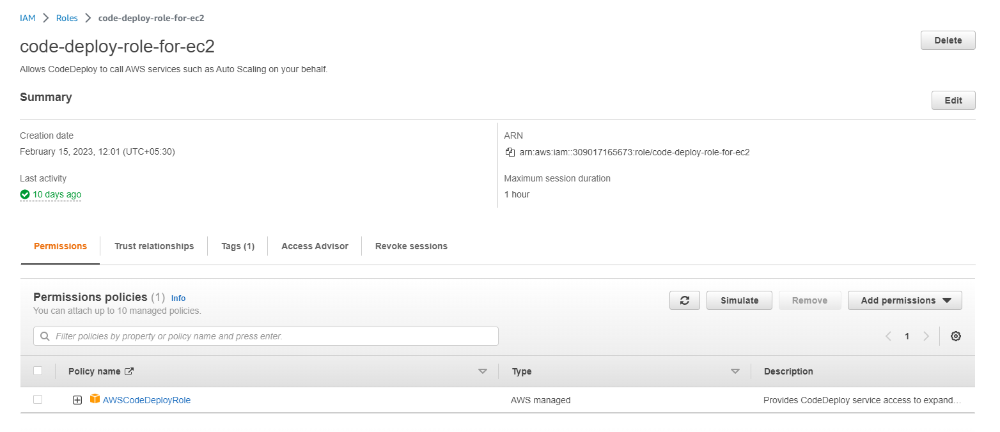

### Create Code Deploy Application 

We will start by creating the Code Deploy application, for this go to the CODE DEPLOY service and click on **Create Application**
  

Enter the name of the application and choose the platform of deployment, then click on **create application**

  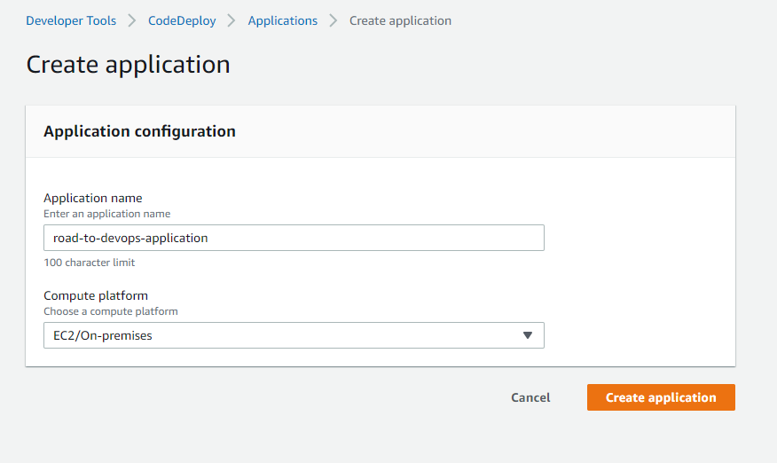

Next click on **create deployment group**, then enter the name of the deployment group as **road-to-devops-application** and choose service role which you created above 

  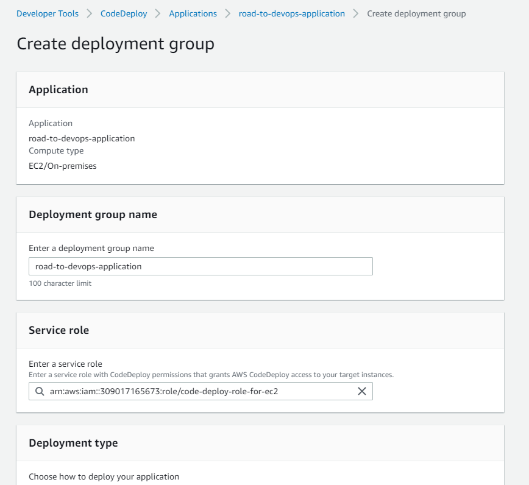

Choose deployment type as **In-Place** and then choose the name of the EC2 instance 
Now firstly go to the CodePipeline section and create the CodePipeline 

  

Now just enter the name of the CodePipeline such as for this blog, we are creating "road-to-devops-pipeline"

  

  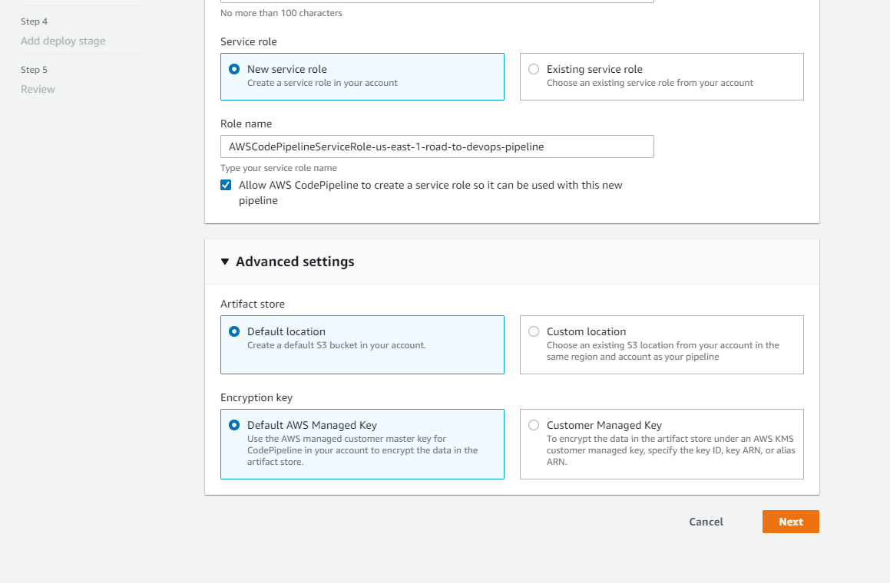

### Create Source stage 

- The first stage includes the Source where we create connection from github/bitbucket to the code pipeline using login credentials or code star connection

  

#### Connecting using Github Version 1 

  

Click on connect to Github and authorize with the Githubrepo 

  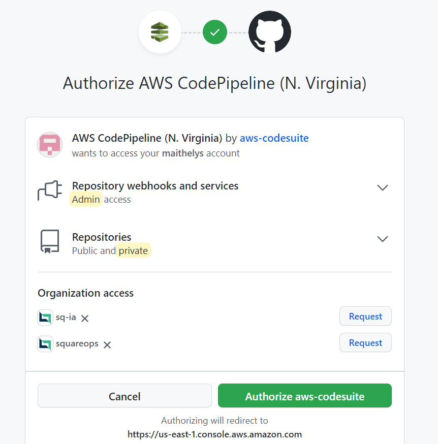


#### Connecting using Github Version 2 

Connecting using Github version 2 is the secure and recommended way  

  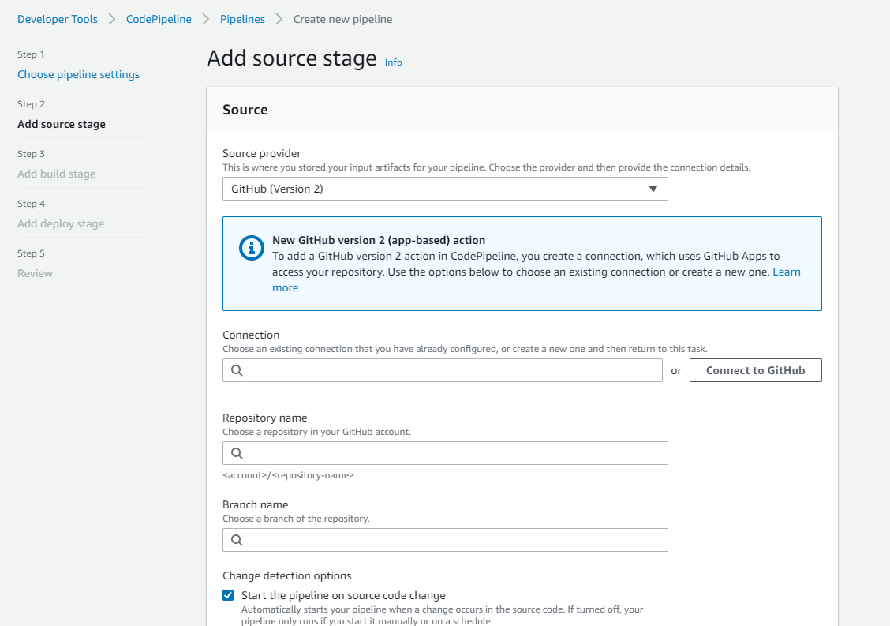

Click on connect to github and enter the connection name 

  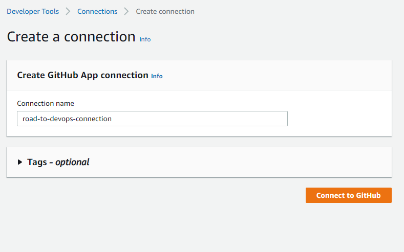

Then click on "Connect to Github" and click on "Authorize AWS connector for Github"

  

After this it will redirect to the github source connection page 

  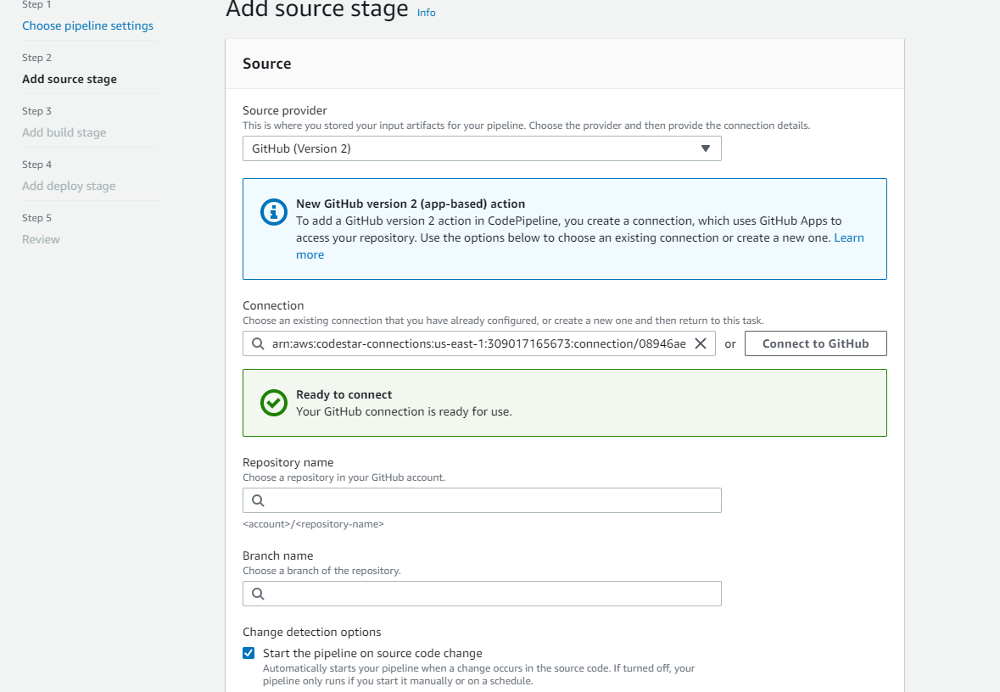

Here enter the Repository name and branch name which needs to be deployed 

### Create Build Stage 

Start with Code build stage and choose AWS Codebuild 

  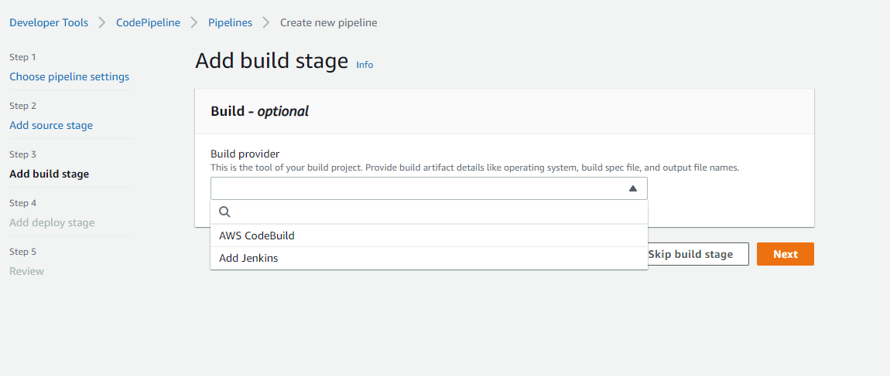

Click on create the build project and it will redirect to create a build project where we have to provide the name of the project and then the source provider which can be from git to S3 bucket (using default s3 bucket ).

  

Keep Image environment settings as follows 

  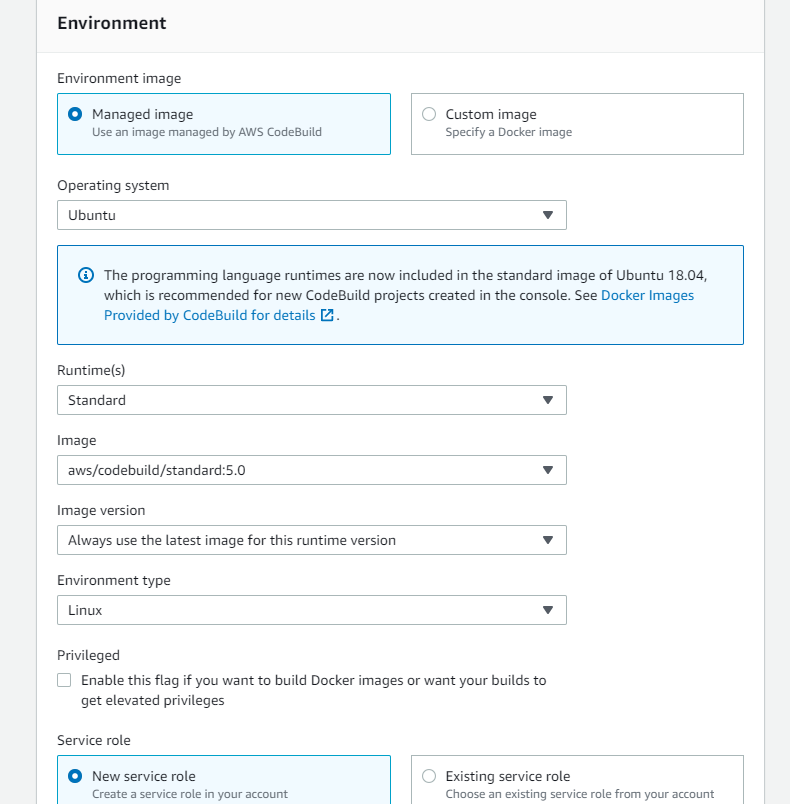

Use build spec file stored in code as the code build project basically looks for the buildspec file in the root directory of the source provider . If the buildspec file has some other name then we can provide the same name in the project build. Once the project is created then we can build the project . 

  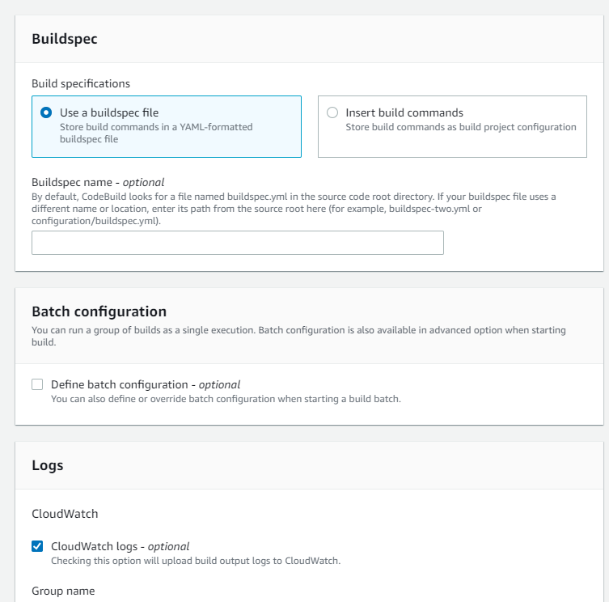

Last step is to click on "Continue to CodePipeline" 

  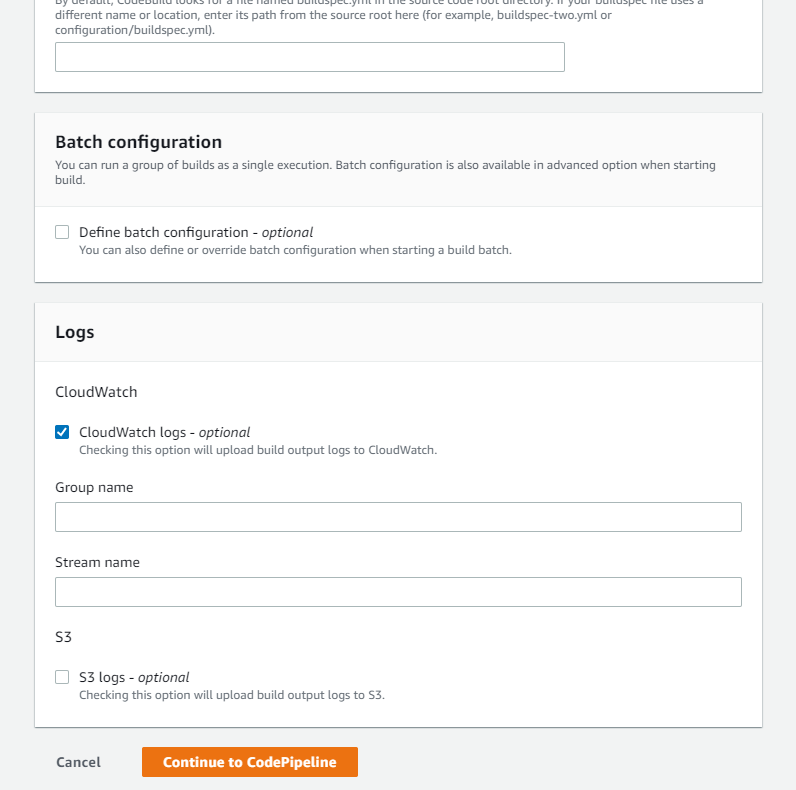

  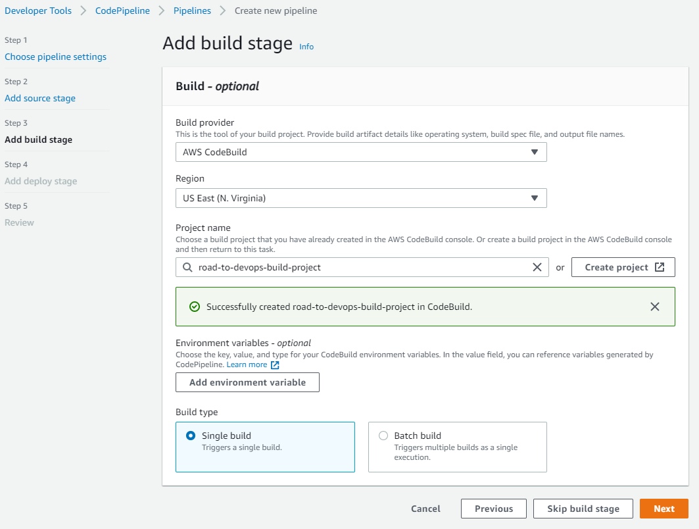

Now click on next and add code deploy stage 
Here is the buildpec.yml file configuration which is stored in the root directory of the github repository 


- The buildspec file basically contains the information about variables to be taken from and then pre-build, build and post build steps.

- The build artifact stored in s3 bucket

### Create Code Deploy stage 
Here is the appspec.yml file configuration 

The appspec file contains information about the commands to be run during different hooks like ApplicationStop, ApplicationStart, BeforeInstall.

Successfully executed the deployment phase from the build artifact stored in s3


After the successful build is done we can move to the next step called CodeDeploy.Here we will first create the application .After the application is created we will now create the deployment group where we can provide the information like service role , type of deployment, environment (like instances which can be on-premise or from autoscaling group) and the load balancer.

Install code deploy agent as follows on ec2 instance or adding as user data in launch template: 

```
#!/bin/bash
sudo apt-get update
sudo apt-get install ruby
sudo apt-get install wget
cd /home/ubuntu
wget https://aws-codedeploy-us-east-2.s3.us-east02.amazonaws.com/latest/install
chmod +x ./install
sudo ./install auto
```

For checking the service 

        sudo service codedeploy-agent status

Step – 7: Details of Instance, in which the application was deployed


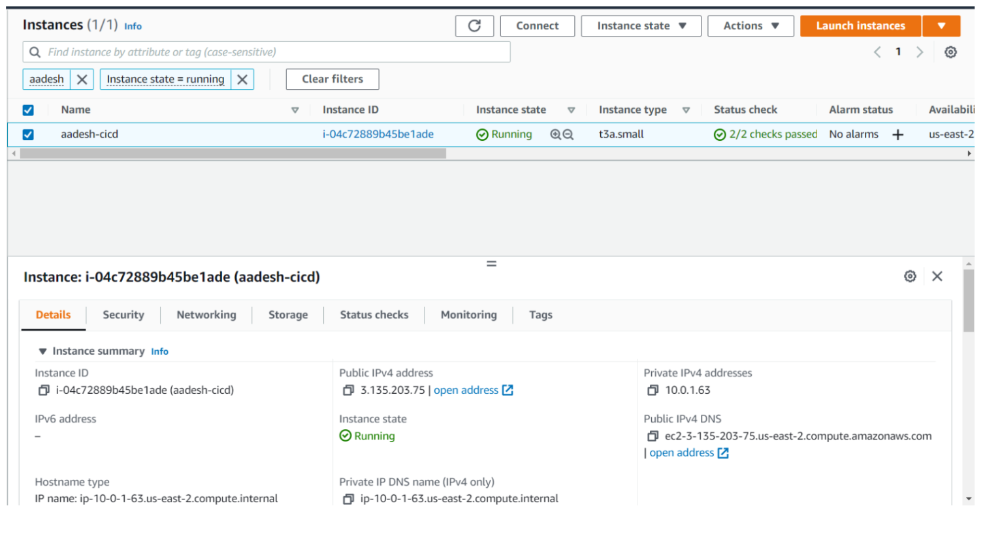

Step – 8: After hitting the Public IPv4 of the instance, the wordpress install page appeared


After installation WP was working

This is how the code pipeline looks after all the 3 stages executed successfully 


