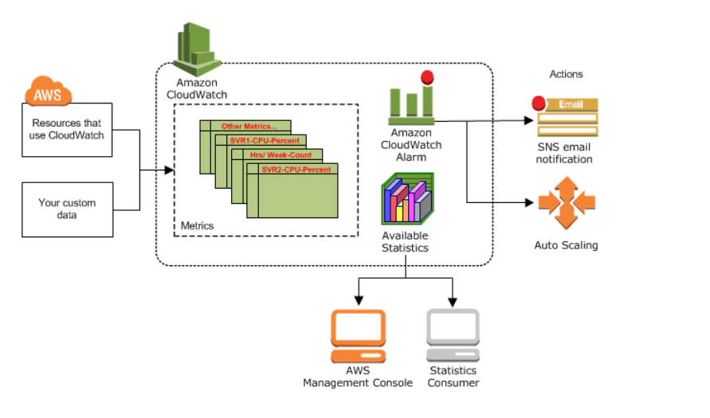
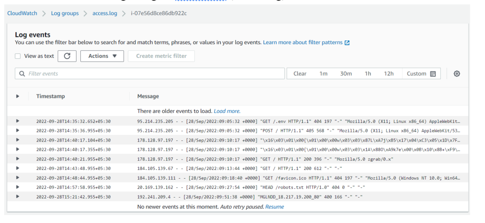
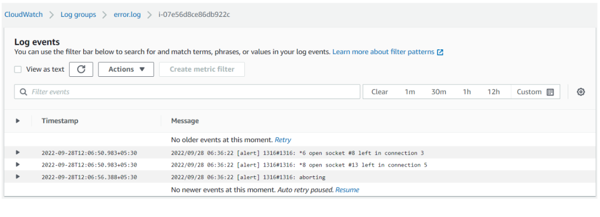
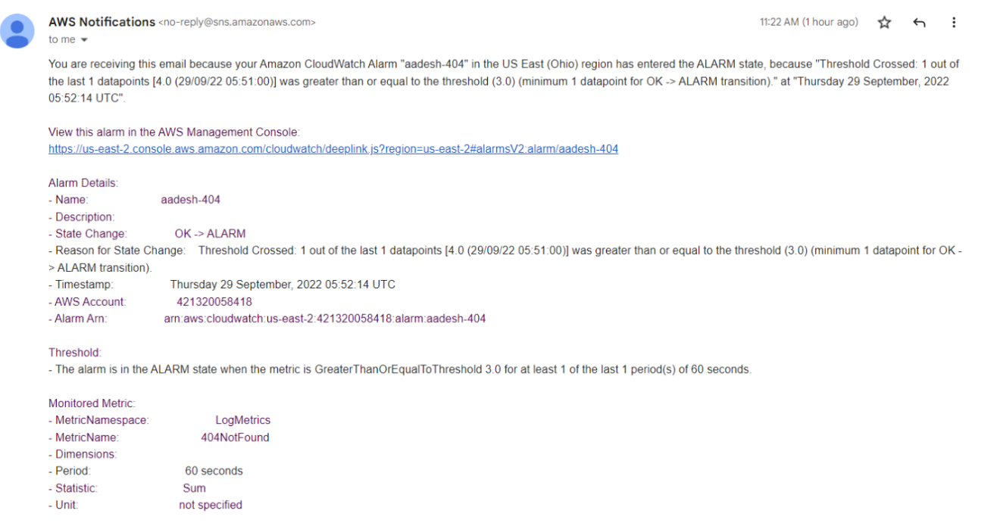
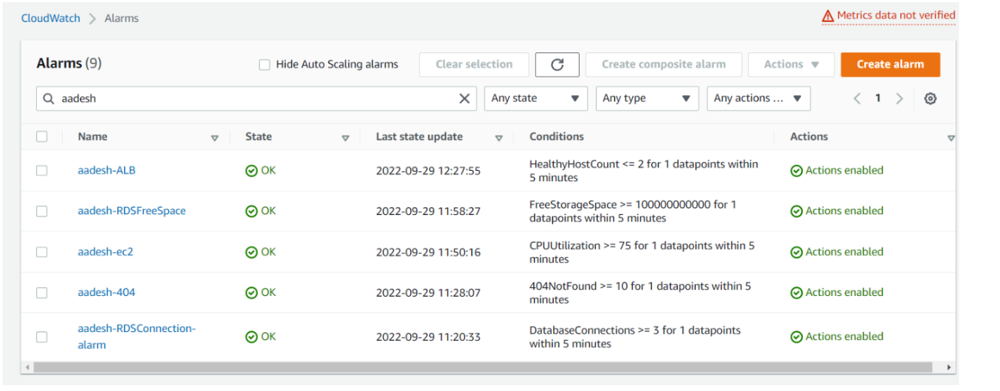

# CloudWatch Monitoring 

Amazon CloudWatch collects and visualizes real-time logs, metrics, and event data in automated dashboards to streamline your infrastructure and application maintenance.

  

The CloudWatch Logs agent provides an automated way to send log data to CloudWatch Logs from Amazon EC2 instances. The agent includes the following components:

- A plug-in to the AWS CLI that pushes log data to CloudWatch Logs.

- A script (daemon) that initiates the process to push data to CloudWatch Logs.

- A cron job that ensures that the daemon is always running.

Amazon CloudWatch monitors your Amazon Web Services (AWS) resources and the applications you run on AWS in real time. You can use CloudWatch to collect and track metrics, which are variables you can measure for your resources and applications.

The CloudWatch home page automatically displays metrics about every AWS service you use. You can additionally create custom dashboards to display metrics about your custom applications, and display custom collections of metrics that you choose.

You can create alarms that watch metrics and send notifications or automatically make changes to the resources you are monitoring when a threshold is breached. For example, you can monitor the CPU usage and disk reads and writes of your Amazon EC2 instances and then use that data to determine whether you should launch additional instances to handle increased load. You can also use this data to stop under-used instances to save money.

With CloudWatch, you gain system-wide visibility into resource utilization, application performance, and operational health.

## How Amazon CloudWatch works

Amazon CloudWatch is basically a metrics repository. An AWS service—such as Amazon EC2—puts metrics into the repository, and you retrieve statistics based on those metrics. If you put your own custom metrics into the repository, you can retrieve statistics on these metrics as well.



### AWS CLOUD WATCH can monitor all the AWS RESOURCES deployed in the account such as: 
1. EC2 instances 
2. Application LoadBalancer 
3. ACM 
4. RDS
5. Elasticache
6. ECS 
7. EKS 
8. EBS 
9. Lambda
10. Route 53
11. SNS 
12. S3
13. Amplify
14. Codebuild
15. Chatbot

### Such as if we take an example for EC2 instances, so we will monitor these main metrics:
1. CPU utilization 
2. RAM utilization 
3. Disk usage

### Here you can view all the metrics that we can monitor
1. [EC2 metrics](https://docs.aws.amazon.com/AWSEC2/latest/UserGuide/viewing_metrics_with_cloudwatch.html) 
2. [ALB metrics](https://docs.aws.amazon.com/elasticloadbalancing/latest/application/load-balancer-cloudwatch-metrics.html)
3. [RDS metrics](https://docs.aws.amazon.com/AmazonRDS/latest/UserGuide/rds-metrics.html)
4. 
## Install the unified CloudWatch agent on the AMI and use SSM Parameter store to configure unified CloudWatch agent

1. Installation of unified CloudWatch Agent on EC2 instance

```
#!/bin/bash
sudo mkdir /tmp/cwa
cd /tmp/cwa
sudo wget https://s3.amazonaws.com/amazoncloudwatch-agent/linux/amd64/latest/AmazonCloudWatchAgent.zip -O AmazonCloudWatchAgent.zip
sudo apt-get install -y unzip
sudo unzip -o AmazonCloudWatchAgent.zip
sudo ./install.sh
sudo mkdir -p /usr/share/collectd/
sudo touch /usr/share/collectd/types.db 
sudo /opt/aws/amazon-cloudwatch-agent/bin/amazon-cloudwatch-agent-ctl -a fetch-config -m ec2 -c file:/opt/aws/amazon-cloudwatch-agent/bin/config.json -s

/opt/aws/amazon-cloudwatch-agent/bin/amazon-cloudwatch-agent-ctl -m ec2 -a status
{ 
"status": "running", 
"starttime": "2020-06-07T10:04:41+00:00", 
"version": "1.245315.0" 
}
systemctl status amazon-cloudwatch-agent.service
```

Run the CodeDeploy Agent wizard after this, and SSM Parameter Store will be configured there itself.

2. Code to use SSM Parameter Store to configure Unified CloudWatch Agent

```
sudo /opt/aws/amazon-cloudwatch-agent/bin/amazon-cloudwatch-agent-ctl -a fetch-config -m ec2 -c ssm:AmazonCloudWatch-RoadToDevops –s
```
3. Created a CloudWatch Dashboard, added EC2 and RDS Metrics


4. Shipped logs from the instance:

### a. Access log of Nginx Webserver (access.log)



### b. Error log of Nginx Web Server (error.log)



### c. syslog


5. Created metric filter for 404 status code access.log


### a. Created a 404 Alarm based on this metric and an SNS Alert also executed



6. Alarms



7. Chaos Testing

- EC2 SNS Trigger for CPUUtilization Metric


- Command used for stress testing:

            sudo apt install stress
            stress –c 4 –m 6 –d 4

- RDS SNS alert for DatabaseConnections Metric


- Script used to test DB Connections


- SNS alert for FreeStorageSpace Metric

- ELB SNS Trigger for HealthyHostCount Metric


- Tested by manually terminating target instances.


