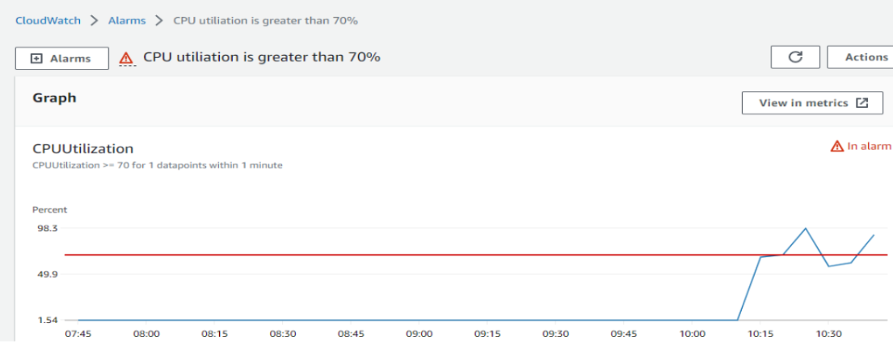
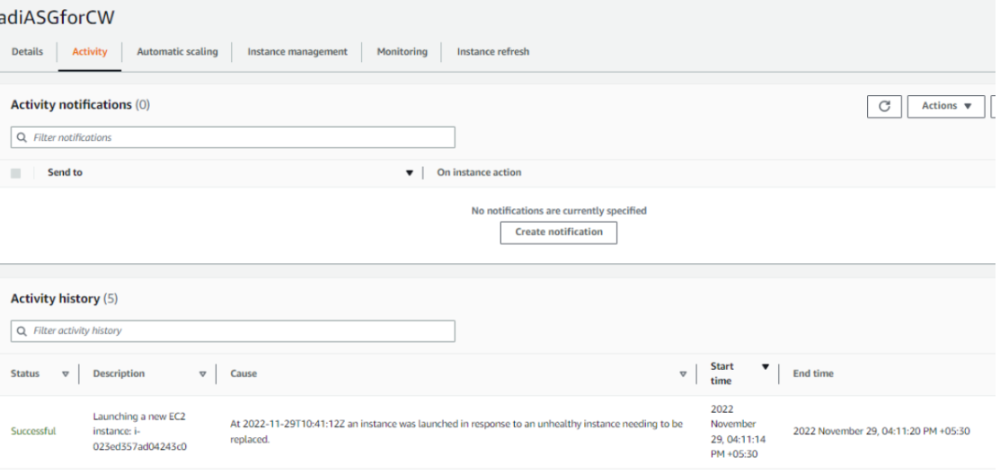
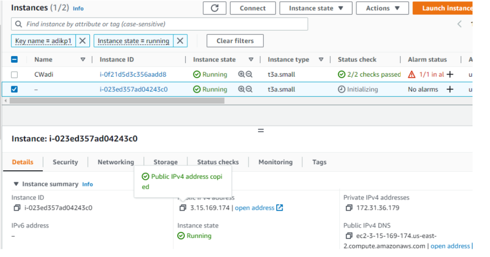
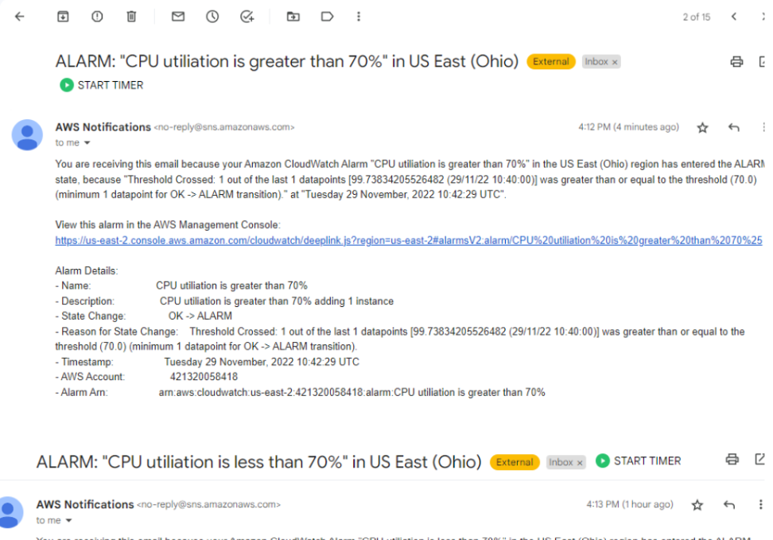
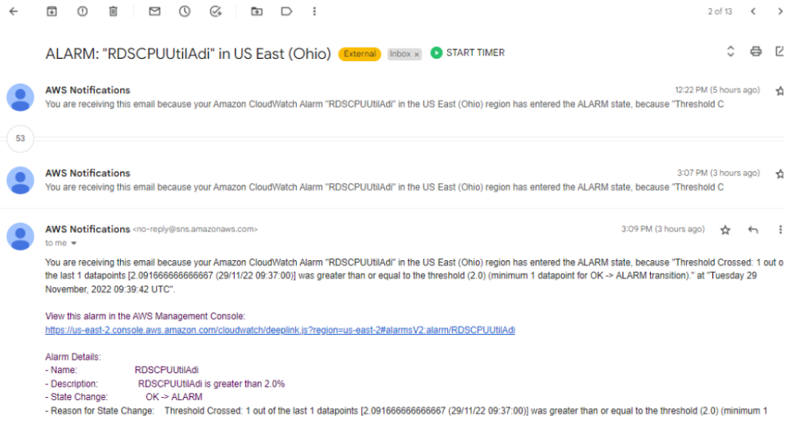
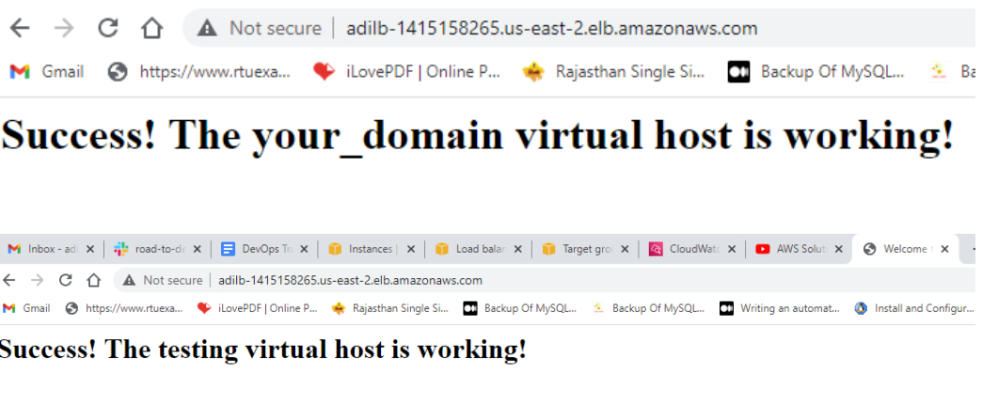

# Cloudwatch for monitoring AWS RESOURCES 

## Monitoring EC2 instances in ASG using CloudWatch

- Firstly we will create an AMI from my instance on which CloudWatch Agent is installed 
- Secondly we will create a launch template from the AMI we have created. Give a name of the Launch template according to you. Under AMI slot choose the AMI that you have created. Give a key pair that you want all the EC2 instance that ASG will create have it, then click on create Launch template.
- Now select the launch template and click on action and select create Auto Scaling Group. Now give a name to it according to your understanding. Give your inputs for maximum number of instances that needs to be created, minimum number of instances and required number of instances and create the Auto Scaling Group.
- Then open the ASG and create the Dynamic policies by simple scaling as an option in automatic scaling tab. Create two policies one for adding the instance and one for deleting the instance.

- Then create the alarm for both the policies with the CPU utilization (you can choose anyone parameter) as metrics and add the threshold parameter as required. 

- Then I have installed the stress application in my instance by using “sudo apt-get install stress”.

- Then give stress to CPU by command “ sudo stress --cpu  100 --timeout 500 ”.

- Then watch the CPU utilization metrics and activity log of ASG.

- Below is the image of CPU utilization metrics exceeding the threshold limit of 70%.

- As soon as CPU utilization increases to 70% or more ASG launched one instance to match the requirement.

- Below is the screenshot of extra launched instance by ASG.

- Below is the screenshot of accessing the index.html from the launched instance by ASG. We can match the ip in both the snips they are same.

- When CPU utilization decreased below to 70%, ASG automatically terminating the instance. Below is the screenshot.

- As we have configured the SNS also so we are getting the alerts also on the mail of CPU utilization.

## RDS in CloudWatch
- Similarly, we can monitor the RDS required metrics and add SNS to get the alerts. Below are the required screenshots.

## ALB in CloudWatch
Similarly, we can work on ALB also. Here, we have one target group in which we have added 2 targets to balance the load. So we have created 1 ALB to manage the load. After, completion of ALB we got the DNS so that we can hit and check, whether our ALB is working properly or not. So after hitting we are redirected to both the servers from the same link which confirms that ALB is working fine.

We have also added the Healthy and Unhealthy host count on cloudwatch dashboard to monitor the status. Below, is the snip.

