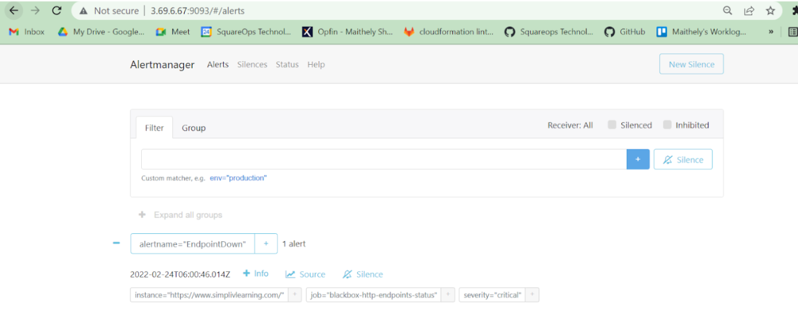
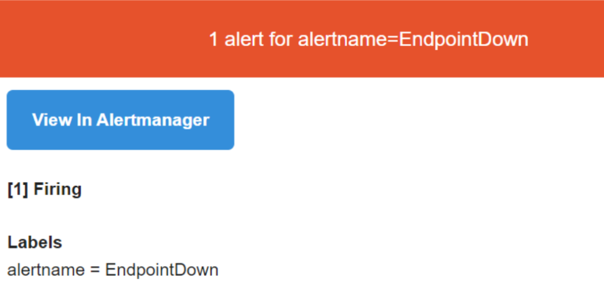

## Alerting in Prometheus using alert manger by running the following commands:

```
wget https://github.com/prometheus/alertmanager/releases/download/v0.23.0/alertmanager-0.23.0.linux-amd64.tar.gz
tar -xvf alertmanager-0.23.0.linux-amd64.tar.gz
cd ~/alertmanager-0.23.0.linux-amd64/
sudo cp -r . /usr/local/bin/alertmanager
```
## Create service file
```
sudo vi /etc/systemd/system/alertmanager.service

[Unit]
Description=AlertManager Server Service
Wants=network-online.target
After=network-online.target

[Service]
User=root
Group=root
Type=simple
ExecStart=/usr/local/bin/alertmanager/alertmanager --config.file /usr/local/bin/alertmanager/alertmanager.yml
[Install]
WantedBy=multi-user.target
```

## Create alertmanager configuration file 

```
sudo vim /usr/local/bin/alertmanager/alertmanager.yml

global:
  resolve_timeout: 5m
  smtp_from: 'alerts@abc.com'
  smtp_auth_username: 'alerts@abc.com'
  smtp_auth_password: 'Qwerty@!7890'
  smtp_smarthost: 'smtp.office365.com:587'
route:
  group_by: ['alertname']
  group_wait: 10s
  group_interval: 5m
  repeat_interval: 5m
  receiver: 'email'
receivers:
- name: 'email'
  email_configs:
  - to: 'devops@squareops.com,abc@xyz.com'
    require_tls: yes
inhibit_rules:
  - source_match:
      severity: 'critical'
    target_match:
      severity: 'warning'
    equal: ['alertname', 'instance']
```

## Change file permissions 
```
cd /usr/local/bin/alertmanager/
sudo chmod 777 alertmanager alertmanager.yml
```

## Create rules in for alerting

```
sudo vim /etc/prometheus/alert.rules.yml

groups:
- name: alert.rules
  rules:
  - alert: InstanceDown
    expr: up == 0
    for: 1m
    labels:
      severity: "critical"
    annotations:
      summary: "Endpoint {{ $labels.instance }} down"
      description: "{{ $labels.instance }} of job {{ $labels.job }} has been down for more than 1 minutes."
  - alert: HostHighCpuLoad
    expr: (sum by (instance) (irate(node_cpu{job="node_exporter_metrics",mode="idle"}[5m]))) > 80
    for: 5m
    labels:
      severity: warning
    annotations:
      summary: "Host high CPU load (instance {{ $labels.instance }})"
      description: "CPU load is > 80%\n  VALUE = {{ $value }}\n  LABELS: {{ $labels }}"     
  - alert: HostOutOfMemory
    expr: node_memory_MemAvailable / node_memory_MemTotal * 100 < 25
    for: 5m
    labels:
      severity: warning
    annotations:
      summary: "Host out of memory (instance {{ $labels.instance }})"
      description: "Node memory is filling up (< 25% left)\n  VALUE = {{ $value }}\n  LABELS: {{ $labels }}"
  - alert: HostOutOfDiskSpace
    expr: (node_filesystem_avail{mountpoint="/"}  * 100) / node_filesystem_size{mountpoint="/"} < 30
    for: 1s
    labels:
      severity: warning
    annotations:
      summary: "Host out of disk space (instance {{ $labels.instance }})"
      description: "Disk is almost full (< 30% left)\n  VALUE = {{ $value }}\n  LABELS: {{ $labels }}"
  - alert: EndpointDown
    expr: probe_success == 0
    for: 10s
    labels:
      severity: "critical"
    annotations:
      summary: "Endpoint {{ $labels.instance }} down" 

```
## Create alert rules configuration in prometheus.yml file 
```
sudo vim /etc/prometheus/prometheus.yml

rule_files:
  - alert.rules.yml
alerting:
  alertmanagers:
  - static_configs:
    - targets:
      - 'localhost:9093'
```

## start alertmanager service 
```
sudo systemctl daemon-reload

sudo systemctl start alertmanager

sudo systemctl status alertmanager

/usr/local/bin/alertmanager/amtool check-config /usr/local/bin/alertmanager/alertmanager.yml

sudo systemctl stop node_exporter && sudo systemctl start node_exporter && sudo systemctl stop prometheus && sudo systemctl start prometheus && sudo systemctl stop alertmanager && sudo systemctl start alertmanager

journalctl -xe -u alertmanager.service 
```
- Check alerts configured in prometheus 


- Check alerts in alertmanager as well at 9093 port



- Then for verification check alerts being sent on the desired target (such as in this case it is email)




