# Setup K3s Cluster 

Here we will setup a kubernetes cluster with one master and one worker node using K3s 

- [Setup K3s Cluster](#setup-k3s-cluster)
  - [Step 1: Deploy Network](#step-1-deploy-network)
  - [Step 2 : Create IAM roles](#step-2--create-iam-roles)
  - [Step 3 : Configure Master Node](#step-3--configure-master-node)
  - [Step 4 : Configure Worker  Node](#step-4--configure-worker--node)
  - [Step 4 : Verify the Master node](#step-4--verify-the-master-node)

## Step 1: Deploy Network 

We will deploy ISOLATED networking components using Terraform. These are the following AWS resources which will be created:
- VPC
- Public Subnets 
- Private Subnets 
- IGW 
- NAT Gateway 
- Route Tables 

Firstly Install Terraform on your local or EC2 instance with [latest version](https://developer.hashicorp.com/terraform/tutorials/aws-get-started/install-cli). Also make sure you have configured AWS-CLI 

Now create a directory using the following command 

    mkdir terraform-vpc 


Then create a file named **main.tf** and paste the following code in it 

```
module "vpc" {
  source = "terraform-aws-modules/vpc/aws"

  name = "road-to-devops-network"
  cidr = "10.0.0.0/16"

  azs             = ["us-east-1a", "us-east-1b", "us-east-1c"]
  private_subnets = ["10.0.1.0/24", "10.0.2.0/24", "10.0.3.0/24"]
  public_subnets  = ["10.0.101.0/24", "10.0.102.0/24", "10.0.103.0/24"]

  enable_nat_gateway = true
  enable_vpn_gateway = false

  tags = {
    "kubernetes.io/cluster/road-to-devops" = "owned"
  }
}
```

**Note: Make sure you add the following tag on all the networking components "kubernetes.io/cluster/road-to-devops" = "owned"**

Run the followings commands

    terraform init          // to initialize the directory 

    terraform plan          // to plan the components which will be creating using the module 

    terraform apply         // to deploy the resources (enter yes after running the following command)


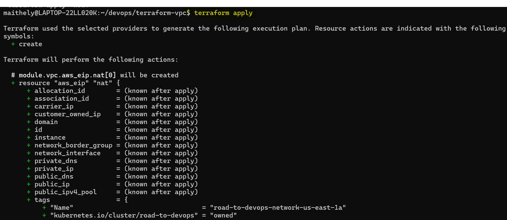

Lastly verify the AWS resources created 

- VPC with required tags 

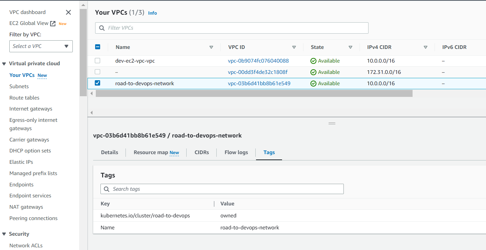

- In all the Public Subnets, add the following tag with key **kubernetes.io/role/elb** and value **1**

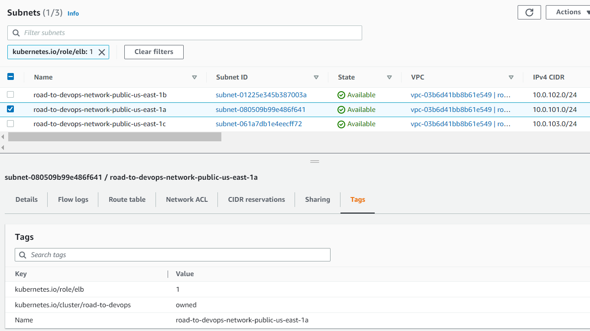

- In all the Private Subnets, add the following tag with key **kubernetes.io/role/internal-elb** and value **1**

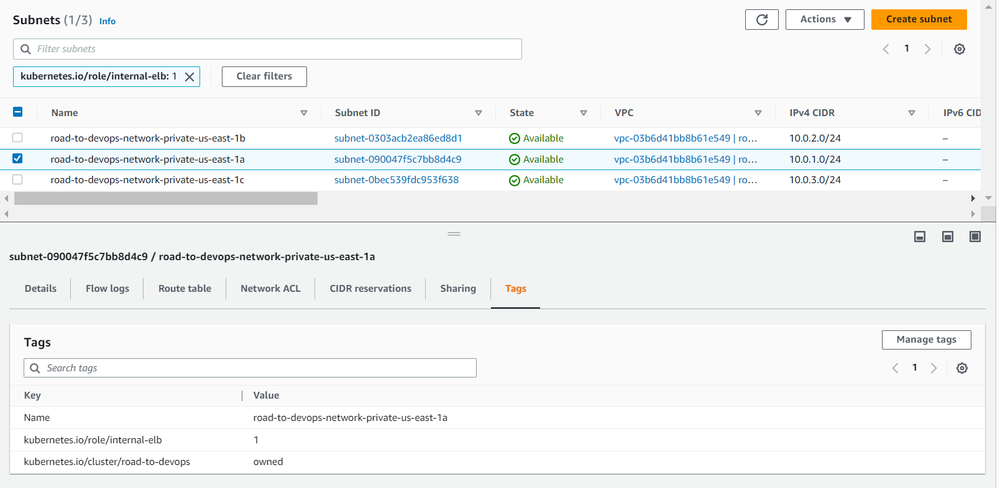

- Now create a security group with the following tag with key **kubernetes.io/cluster/road-to-devops**" and value **owned**


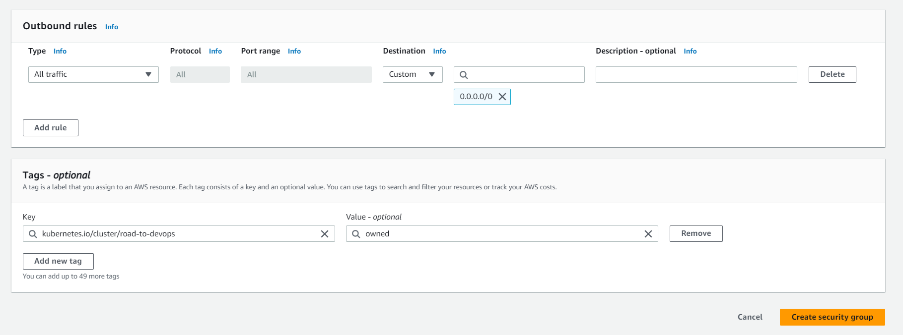

- In the inbound rules of the security group allow **all traffic** from the the security group itself 


## Step 2 : Create IAM roles 

Using the following [link](https://kubernetes.github.io/cloud-provider-aws/prerequisites/) to create policies for both master and worker nodes respectively 

Go to IAM and click on **create policy**, then choose the JSON tab and paste the following master policy 


```
{
  "Version": "2012-10-17",
  "Statement": [
    {
      "Effect": "Allow",
      "Action": [
        "autoscaling:DescribeAutoScalingGroups",
        "autoscaling:DescribeLaunchConfigurations",
        "autoscaling:DescribeTags",
        "ec2:DescribeInstances",
        "ec2:DescribeRegions",
        "ec2:DescribeRouteTables",
        "ec2:DescribeSecurityGroups",
        "ec2:DescribeSubnets",
        "ec2:DescribeVolumes",
        "ec2:CreateSecurityGroup",
        "ec2:CreateTags",
        "ec2:CreateVolume",
        "ec2:ModifyInstanceAttribute",
        "ec2:ModifyVolume",
        "ec2:AttachVolume",
        "ec2:AuthorizeSecurityGroupIngress",
        "ec2:CreateRoute",
        "ec2:DeleteRoute",
        "ec2:DeleteSecurityGroup",
        "ec2:DeleteVolume",
        "ec2:DetachVolume",
        "ec2:RevokeSecurityGroupIngress",
        "ec2:DescribeVpcs",
        "elasticloadbalancing:AddTags",
        "elasticloadbalancing:AttachLoadBalancerToSubnets",
        "elasticloadbalancing:ApplySecurityGroupsToLoadBalancer",
        "elasticloadbalancing:CreateLoadBalancer",
        "elasticloadbalancing:CreateLoadBalancerPolicy",
        "elasticloadbalancing:CreateLoadBalancerListeners",
        "elasticloadbalancing:ConfigureHealthCheck",
        "elasticloadbalancing:DeleteLoadBalancer",
        "elasticloadbalancing:DeleteLoadBalancerListeners",
        "elasticloadbalancing:DescribeLoadBalancers",
        "elasticloadbalancing:DescribeLoadBalancerAttributes",
        "elasticloadbalancing:DetachLoadBalancerFromSubnets",
        "elasticloadbalancing:DeregisterInstancesFromLoadBalancer",
        "elasticloadbalancing:ModifyLoadBalancerAttributes",
        "elasticloadbalancing:RegisterInstancesWithLoadBalancer",
        "elasticloadbalancing:SetLoadBalancerPoliciesForBackendServer",
        "elasticloadbalancing:AddTags",
        "elasticloadbalancing:CreateListener",
        "elasticloadbalancing:CreateTargetGroup",
        "elasticloadbalancing:DeleteListener",
        "elasticloadbalancing:DeleteTargetGroup",
        "elasticloadbalancing:DescribeListeners",
        "elasticloadbalancing:DescribeLoadBalancerPolicies",
        "elasticloadbalancing:DescribeTargetGroups",
        "elasticloadbalancing:DescribeTargetHealth",
        "elasticloadbalancing:ModifyListener",
        "elasticloadbalancing:ModifyTargetGroup",
        "elasticloadbalancing:RegisterTargets",
        "elasticloadbalancing:DeregisterTargets",
        "elasticloadbalancing:SetLoadBalancerPoliciesOfListener",
        "iam:CreateServiceLinkedRole",
        "kms:DescribeKey"
      ],
      "Resource": [
        "*"
      ]
    }
  ]
}
```
Click on next and add the policy name, then click on **create policy**


Now create policy for worker node using the following 

```
{
  "Version": "2012-10-17",
  "Statement": [
    {
      "Effect": "Allow",
      "Action": [
        "ec2:DescribeInstances",
        "ec2:DescribeRegions",
        "ecr:GetAuthorizationToken",
        "ecr:BatchCheckLayerAvailability",
        "ecr:GetDownloadUrlForLayer",
        "ecr:GetRepositoryPolicy",
        "ecr:DescribeRepositories",
        "ecr:ListImages",
        "ecr:BatchGetImage"
      ],
      "Resource": "*"
    }
  ]
}
```

Lastly create roles for the policies created respectively 

- click on **create role** and choose **EC2** as common use case then click on next

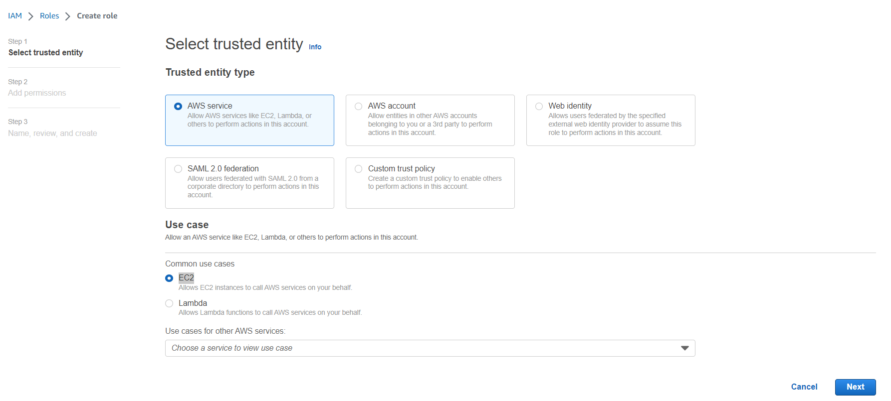 

- check box on the policy created above for **master** and also add policy **AmazonSSMManagedInstanceCore** for session manager to connect EC2 using AWS CONSOLE 

 

- Now enter the name of the role and click on **create role**
  
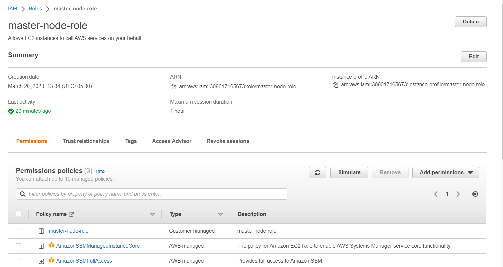 

Similarly create role for **worker node**


## Step 3 : Configure Master Node 

Click on Launch Instance and enter the name of instance as **master-node** and add additional tag with key **kubernetes.io/cluster/road-to-devops** and value **owned**

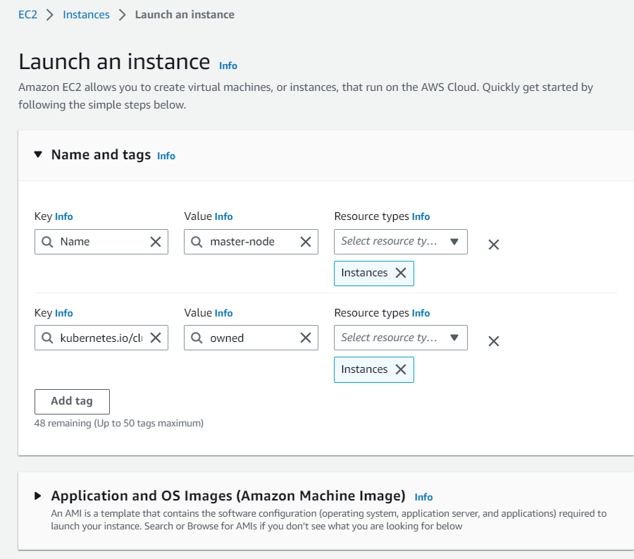

Choose th image as **Ubuntu 20**


Choose instance type as **t3a.medium** and choose required key pair

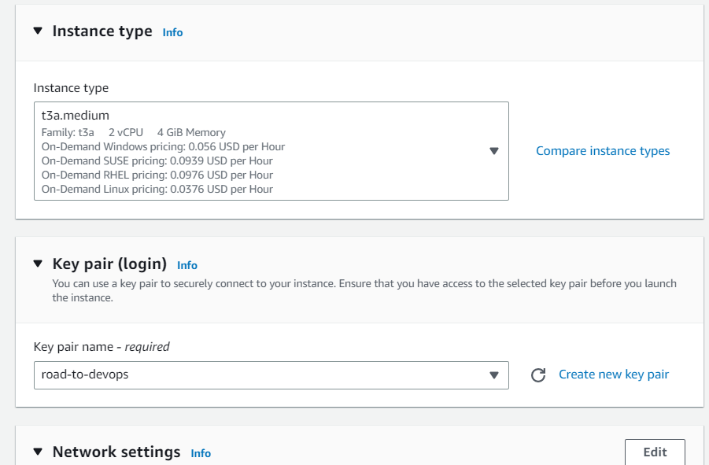

Choose the VPC with public subnet and select the security group created in Step 1

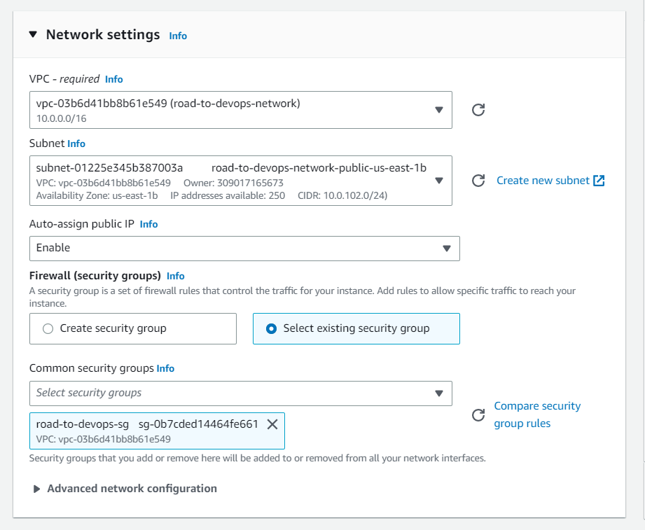

Configure 8 Gb volume and choose the **master-node-role** in IAM instance profile 

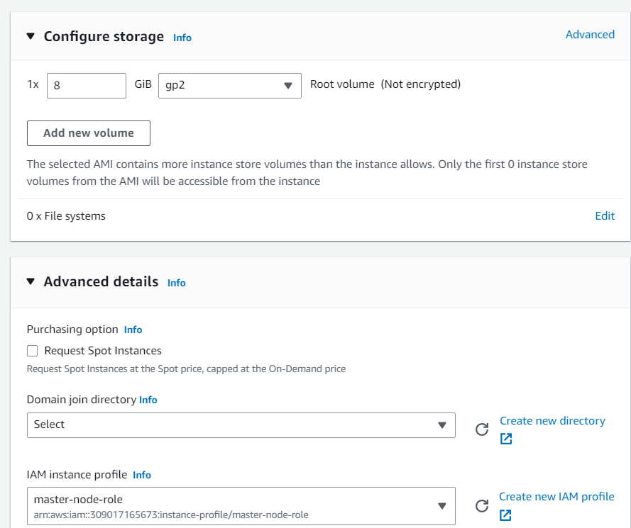

Add the userdata 

```
#!/bin/bash

apt-get update -y
apt-get upgrade -y

local_ip=$(curl -s http://169.254.169.254/latest/meta-data/local-ipv4)
provider_id="$(curl -s http://169.254.169.254/latest/meta-data/placement/availability-zone)/$(curl -s http://169.254.169.254/latest/meta-data/instance-id)"

instance_id=$(curl -s http://169.254.169.254/latest/meta-data/instance-id)

CUR_HOSTNAME=$(cat /etc/hostname)
NEW_HOSTNAME=$instance_id

hostnamectl set-hostname $NEW_HOSTNAME
hostname $NEW_HOSTNAME
sudo sed -i "s/$CUR_HOSTNAME/$NEW_HOSTNAME/g" /etc/hosts
sudo sed -i "s/$CUR_HOSTNAME/$NEW_HOSTNAME/g" /etc/hostname

curl -sfL https://get.k3s.io | INSTALL_K3S_VERSION=v1.23.9+k3s1 K3S_TOKEN=coIeS98V5UxzKYTLX0Uzzd4pkxfPSwBxiCUFtUm1sURd66mnZlT3uhk sh -s - --cluster-init --node-ip $local_ip --advertise-address $local_ip  --kubelet-arg="cloud-provider=external" --flannel-backend=none  --disable-cloud-controller --disable=servicelb --disable=traefik --write-kubeconfig-mode 644 --kubelet-arg="provider-id=aws:///$provider_id"

kubectl apply -f https://github.com/aws/aws-node-termination-handler/releases/download/v1.13.3/all-resources.yaml
kubectl apply -f https://raw.githubusercontent.com/rahul-yadav-hub/K3s-aws/main/aws/rbac.yml
kubectl apply -f https://raw.githubusercontent.com/rahul-yadav-hub/K3s-aws/main/aws/aws-cloud-controller-manager-daemonset.yml
kubectl apply -f https://raw.githubusercontent.com/projectcalico/calico/v3.25.0/manifests/calico.yaml
```

Now click on **Launch Instance**

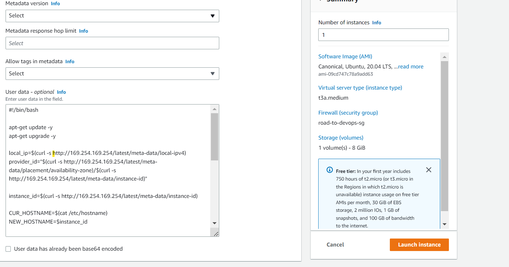

Note down the private IP of the master node instance which will be used in next step i.e 10.0.101.8

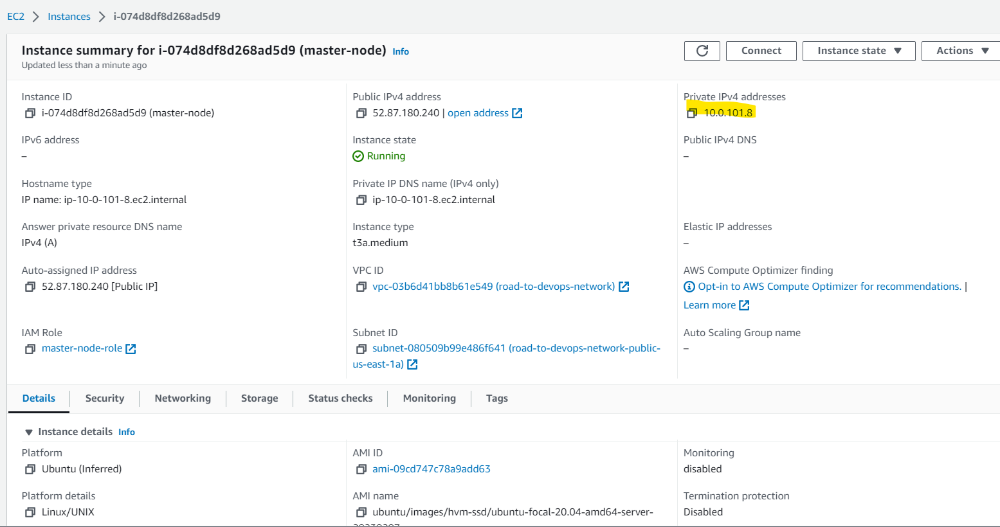

## Step 4 : Configure Worker  Node 


Click on Launch Instance and enter the name of instance as **worker-node** and add additional tag with key **kubernetes.io/cluster/road-to-devops** and value **owned**

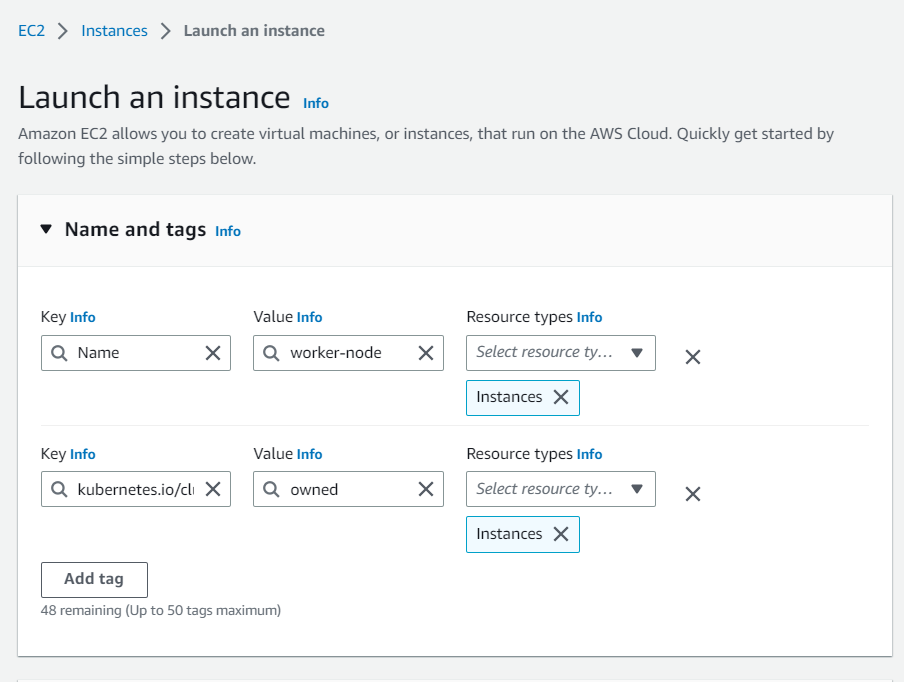

Choose th image as **Ubuntu 20**


Choose instance type as **t3a.medium** and choose required key pair


Choose the VPC with public subnet and select the security group created in Step 1

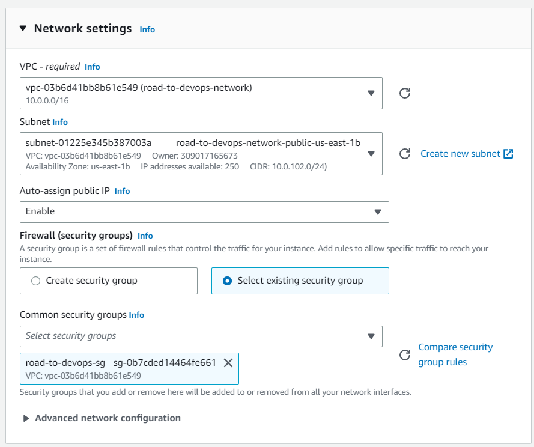

**note: use same security group for both master and worker node**

Configure 8 Gb volume and choose the **master-node-role** in IAM instance profile 


Add the userdata 

```
#!/bin/bash

apt-get update
apt-get upgrade -y

local_ip=$(curl -s http://169.254.169.254/latest/meta-data/local-ipv4)
flannel_iface=$(ip -4 route ls | grep default | grep -Po '(?<=dev )(\S+)')
provider_id="$(curl -s http://169.254.169.254/latest/meta-data/placement/availability-zone)/$(curl -s http://169.254.169.254/latest/meta-data/instance-id)"
instance_id="$(curl -s http://169.254.169.254/latest/meta-data/instance-id)"

CUR_HOSTNAME=$(cat /etc/hostname)
NEW_HOSTNAME=$instance_id

hostnamectl set-hostname $NEW_HOSTNAME
hostname $NEW_HOSTNAME

sudo sed -i "s/$CUR_HOSTNAME/$NEW_HOSTNAME/g" /etc/hosts
sudo sed -i "s/$CUR_HOSTNAME/$NEW_HOSTNAME/g" /etc/hostname

curl -sfL https://get.k3s.io | INSTALL_K3S_VERSION=v1.23.9+k3s1 K3S_TOKEN=coIeS98V5UxzKYTLX0Uzzd4pkxfPSwBxiCUFtUm1sURd66mnZlT3uhk K3S_URL=https://PRIVATE-IP-MASTER-NODE:6443 sh -s - agent --node-ip $local_ip  --kubelet-arg="provider-id=aws:///$provider_id"
```

**note: In the K3S_URL enter the private IP of master node such as in this case we have 10.0.101.8**

Now click on **Launch Instance**

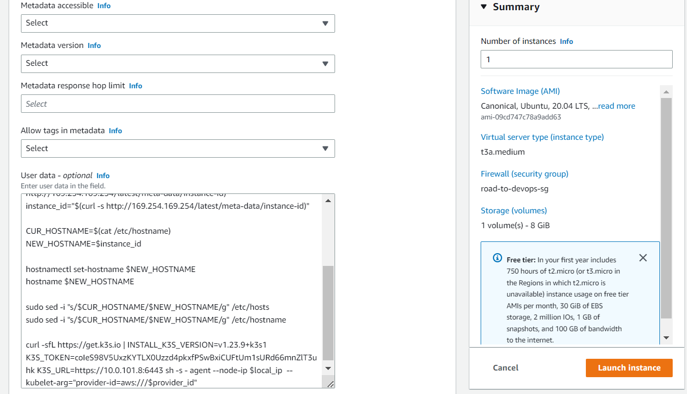

## Step 4 : Verify the Master node 

Check the nodes are successfully running on the master node. Run the following command on master node to see that both nodes are up and running

    kubectl get nodes


K3s cluster is ready and now you can run practice on it to deploy application in the next lecture 