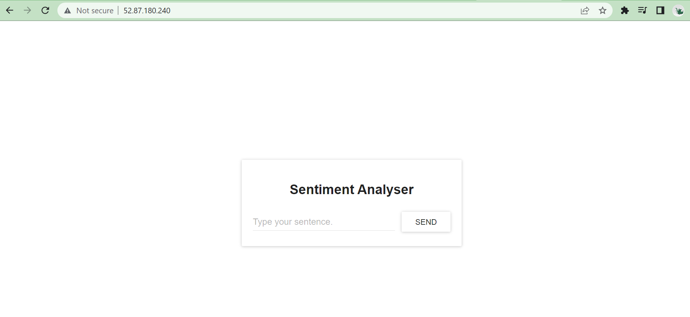

# Docker Containers 

We assume that in [Level 1, section 7](https://github.com/squareops/road-to-devops/blob/develop/Level-1/M7-Docker/L09-DockerHandsOn.md) you must have gone through the deployment of Sentiment Analysis application on Docker container. If not, check the above link and store docker images to the ECR or DockerHub Repository

- [Docker Containers](#docker-containers)
  - [Overview:](#overview)
  - [Pre-Requisites](#pre-requisites)
  - [Step 1: Pull the Docker Images](#step-1-pull-the-docker-images)
  - [Step 2: Run the Docker Containers](#step-2-run-the-docker-containers)

## Overview:
In this tutorial we will deploy application using docker images on the docker containers respectively. Then we will deploy sentiment analysis application on Kubernetes Cluster

## Pre-Requisites 
1. Kubernetes Cluster
2. By now you must be have docker images pushed in ECR or Docker Hub for the application
- sa-logic 
- sa-webapp
- sa-frontend 

## Step 1: Pull the Docker Images 

We have stored docker images in AWS ECR public repository. 


To pull these images on master node, run the following commands 

    docker pull IMAGE_URI 

Like, in our case the image URI is as follows:

```
docker pull public.ecr.aws/u8i3s3j7/road-to-devops-sentiment-analysis:sa-logic

docker pull public.ecr.aws/u8i3s3j7/road-to-devops-sentiment-analysis:sa-webapp

docker pull public.ecr.aws/u8i3s3j7/road-to-devops-sentiment-analysis:sa-front

```
To check the images run the following command

    docker images


**note: you need to install docker on master node to run docker commands**

## Step 2: Run the Docker Containers

Run the following commands to deploy the logic, webapp and frontend container 

```
docker run -d -p 5050:5000 public.ecr.aws/u8i3s3j7/road-to-devops-sentiment-analysis:sa-logic

docker run -d -p 8080:8080 -e SA_LOGIC_API_URL='10.0.101.8:5000' public.ecr.aws/u8i3s3j7/road-to-devops-sentiment-analysis:sa-webapp

docker run -d -p 80:80 public.ecr.aws/u8i3s3j7/road-to-devops-sentiment-analysis:sa-front
```

Check all containers are up and running  with the following command 

    docker ps 


We are done !! Open your browser with public IP of the instance (make sure you have allowed required ports in the security group )



**note : If you changed the port for the sa-webapp, or if you are using docker-machine ip, you need to update App.js file in sa-frontend in the method analyzeSentence to fetch from the new IP or Port. Afterwards you need to build, and use the updated image.**

In this section, we learned about the Dockerfile, how to use it to build an image, and the commands to push it to the Docker registry. Then we got the application running from containers. So why Kubernetes? We will investigate deeper into that in the next lecture, but I want to leave you a brainteaser.

Our Sentiment Analysis web app became a world hit and we suddenly have a million requests per minute to analyze sentiments and we experience huge load on sa-webapp and sa-logic. How can we scale the containers?

**Now here comes Kubernetes to rescue**

Kubernetes solves all these questions (and more!). My attempt to explain Kubernetes in one sentence would be: “Kubernetes is a Container Orchestrator, that abstracts the underlying infrastructure. (Where the containers run)”.

Let's start with deploying application using Kurbernetes in the next lecture 