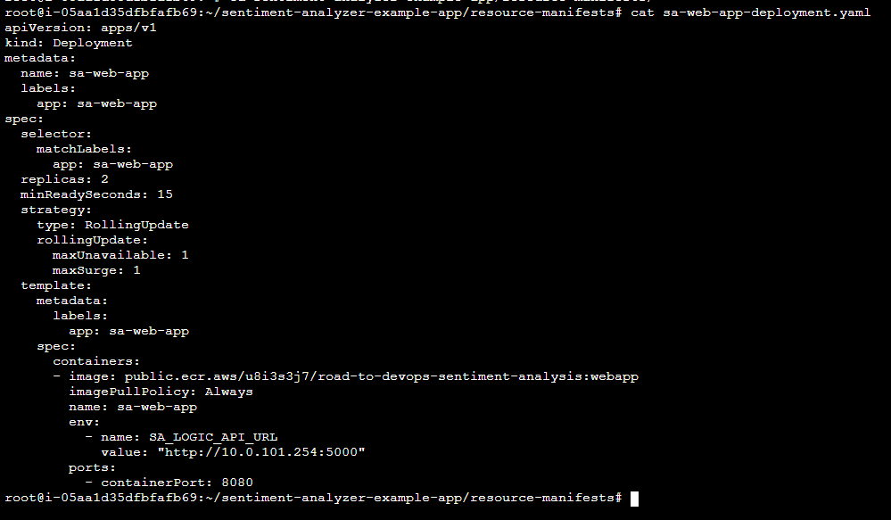

# Deploy Sentiment Analyzer using Kubernetes


## Step 1: Prepare K3S cluster 

## Step 2 : Install dependencies on EC2 

Now SSH into the master and run the following commands

### NodeJs Dependencies
```
apt update
apt install net-tools -y
curl -fsSL https://deb.nodesource.com/setup_14.x | sudo -E bash -
apt-get install gcc make -y
apt-get install nodejs -y 
```

### Docker Dependencies 

```
sudo apt update
sudo apt install apt-transport-https ca-certificates curl software-properties-common
curl -fsSL https://download.docker.com/linux/ubuntu/gpg | sudo apt-key add -
sudo add-apt-repository "deb [arch=amd64] https://download.docker.com/linux/ubuntu focal stable"
apt-cache policy docker-ce
sudo apt install docker-ce
sudo systemctl status docker
```

## Step 3: Clone Github Repository  

        git clone https://github.com/rinormaloku/k8s-mastery.git

## Step 4: Pull docker Images 

We have stored docker images in AWS ECR public repository. 

**note: If you have not stored images on ECR, build the images and store in ECR or Docker Hub** 


To pull these images on master node, run the following commands 

    docker pull IMAGE_URI 

Like, in our case the image URI is as follows:

```
docker pull public.ecr.aws/u8i3s3j7/road-to-devops-sentiment-analysis:sa-logic

docker pull public.ecr.aws/u8i3s3j7/road-to-devops-sentiment-analysis:sa-webapp

docker pull public.ecr.aws/u8i3s3j7/road-to-devops-sentiment-analysis:sa-front

```
To check the images run the following command

    docker images


## Step 5: Setup the Application 

**Run the following commands to deploy logic pods and create logic service**

```
cd sentiment-analyzer-example-app/resource-manifests/ 
kubectl apply -f sa-logic-deployment.yaml
kubectl apply -f service-sa-logic.yaml
```
Now update the SA_LOGIC_API_URL in the sa-webapp/Dockerfile 

```
FROM maven:3.6.0-jdk-11-slim AS build
WORKDIR /app
COPY . .
RUN mvn  clean package
RUN mvn install

FROM openjdk:11-jre-slim
# Environment Variable that defines the endpoint of sentiment-analysis python api.
ENV SA_LOGIC_API_URL http://10.0.101.254:5000
COPY --from=build /app/target/sentiment-analysis-web-0.0.1-SNAPSHOT.jar /usr/local/lib/app.jar
EXPOSE 8080
CMD ["java", "-jar", "/usr/local/lib/app.jar", "--sa.logic.api.url=${SA_LOGIC_API_URL}"]
```

**Run the following commands to deploy webapp pods and create webapp service**

```
cd sentiment-analyzer-example-app/sa-webapp/
docker build -t webapp .
```


Now tag the images builded above as follows 
```
docker tag webapp:latest public.ecr.aws/u8i3s3j7/road-to-devops-sentiment-analysis:webapp 
```
Push this images into the ECR
```
docker tag public.ecr.aws/u8i3s3j7/road-to-devops-sentiment-analysis:webapp 
```

**note: you have installed aws-cli 2 and configured using your IAM User credentials**

Also change API_URL value to sa-logic endpoint in deployment file

```
cd sentiment-analyzer-example-app/resource-manifests/
```


```
kubectl apply -f sa-web-app-deployment.yaml
kubectl apply -f service-sa-web-app-lb.yaml
```

Run the following command to get the services running 
```
root@i-05aa1d35dfbfafb69:~/sentiment-analyzer-example-app/resource-manifests# kubectl get svc
NAME             TYPE           CLUSTER-IP      EXTERNAL-IP                                                              PORT(S)        AGE
kubernetes       ClusterIP      10.43.0.1       <none>                                                                   443/TCP        3h53m
sa-logic         ClusterIP      10.43.149.139   <none>                                                                   80/TCP         3h31m
sa-web-app-lb    LoadBalancer   10.43.83.145    aae11149a40274fcb8ae54f9d4f26e55-415424989.us-east-1.elb.amazonaws.com   80:32382/TCP   130m
```
Pass the above external IP to App.js file of frontend


**Run the following commands to deploy frontend pods and create frontend service**

```
cd sentiment-analyzer-example-app/sa-frontend/

sudo npm install 
sudo npm run build 

cd sentiment-analyzer-example-app/resource-manifests/
kubectl apply -f sa-frontend-deployment.yaml
kubectl apply -f service-sa-frontend-lb.yaml

```


Now check all services and pods are up 


Hit the Domain and the application will work 


## sentiment analyser using kubernetes and ingress ##
Enable ingress by below command

    kubectl apply -f https://raw.githubusercontent.com/kubernetes/ingress-nginx/controller-v1.1.1/deploy/static/provider/cloud/deploy.yaml

Check whether the load balancer created or not in your account

    kubectl get all -n ingress-nginx


git clone 